A draft of a language and protocol to propagate communication demands in TCP/IP networks

by Marco Schnüriger, Kellogg College

March 2016

Department of Computer Science

A dissertation submitted in partial fulfilment of the requirements for the degree of
Master of Science in Software Engineering

Abstract

This dissertation introduces a specification of a language and a protocol to formulate and propagate communication demands in a networked environment. It describes an application-centric way to transmit metadata about desired communication patterns to an underlying network. Integrating this protocol in an application ensures that the underlying network receives basic information to configure itself to fulfil a postulated demand.

The protocol, which has been termed ACDP (Application Communication Demands Protocol), consists of two main parts. The internal domain-specific language is based on a formal description of JSON documents. The second part of ACDP is concerned with the distribution of such ACDP documents or messages. It describes the basic roles of a “Submitter” and a “Receiver” and a way to transmit messages between them. A multi-step process using two unicast and one multicast distribution mechanisms ensures that most of the common deployment scenarios are supported with ACDP. Proof of concept libraries were written for the Submitter and Receiver roles and successfully tested. The test clearly demonstrates that ACDP provides sufficient information to execute the tasks it is aiming for. Wide use of this protocol takes a lot of time and can only be achieved if it will be openly discussed and improved.

Acknowledgements

Special thanks go to Adriano Raiano, an exceptionally gifted Software Engineer, whose patience in answering my questions about JavaScript goes way beyond what could be expected from a busy family man.

Valuable inspiration for the ACDP network protocol came from my friend Beat Stump. He is definitely a network engineer that understands his protocols and who has the rare talent to translate them into words for ordinary people.

It was (and still is) quite hard to fit this dissertation into a specific academic or industrial field of research. Christoph Ernst with his experience in firewall automation and orchestration pointed me to valuable resources which eventually helped me to relate my ideas to other topics.

Lukas Lehmann is an esteemed adviser which enabled me to better understand the needs of a large cloud service provider. I hope that ACDP has taken some of his points into consideration.

I’d also like to thank the many unnamed people that I discussed my ideas with. Some of them were surprisingly excited about it and their words of encouragement were motivating me to bring this draft specification to a level which may make some people’s daily tasks a bit easier (at least I hope so).

Declaration

The author confirms that: this dissertation does not contain material previously submitted for another degree or academic award; and the work presented here is the author's own, except where otherwise stated.

Contents

[1 Introduction & Scope 1]

[1.1 Problem analysis 1]

[1.2 Idea description 3]

[1.3 Document Structure 4]

[2 Background research 5]

[2.1 Software defined networking 5]

[2.2 Automation and Orchestration 5]

[2.3 Discovery Protocols 6]

[2.4 Cloud Services 7]

[2.5 Description of communication patterns 7]

[2.6 DevOps 8]

[3 Project work 9]

[3.1 Reference architecture 9]

[3.2 Detail specification 12]

[3.3 Proof of concept 32]

[4 Analysis and discussion 50]

[4.1 Implementation 50]

[4.2 Specification 50]

[4.3 Final remarks 52]

[5 Appendix 53]

[5.1 Bibliography 53]

[5.2 Table of figures 58]

[5.3 Table of listings 58]

[5.4 ACDP Request Schema 59]

[5.5 Firewall rule creation 64]

[5.6 Code Statistics 66]

Introduction & Scope
==================================================================================================================

Problem analysis
--------------------------------------------------------------------------------------------------------------

In the past, organisations have implemented firewalls to restrict access on the network and transport layer[1]. This essentially means that services or applications are protected from unintentional exposure towards potential attackers by making them unreachable. Even though this principle is quite old and even considered by some to be outdated, firewalls still have their valid claim in most professional environments. The author of this dissertation, himself working as a security architect, argues that from a security point of view, it is still good practice to expose TCP/IP network listeners only to entities that actually need to consume it. This reduces the attack surface and helps, in case of a successful attack to a neighbour system, to limit the extent of such an attack. This is true for any deployment type, regardless of whether the software runs on a physical server, in the cloud or any other setting. Although there are different types of firewalls and the terminology is not always clear, they all have in common that a protected resource is made inaccessible depending on parameters or behaviour to unwanted invocations. Newer types of products work on higher layers. For example, Web Application Firewalls work on the application layer and protect access to URLs and perform protocol checks. The same principle of limiting exposure and spread of an attack can thus be applied on various layers. In other words, every resource should be able to restrict its attack surface by defining an acceptable degree of exposure.

To illustrate this, we can take a look at an abstract example of applications running on a Cloud Foundry Platform-as-a-Service (PaaS) cloud deployment. This is aligned with a real-word situation found in a project the author is currently working on. Some applications need to consume services only from one specific application while others provide services to other applications or the public. The deployment model would, in its most basic form, by default, allow internal communication among all applications. While this is fine from an application developer’s functional point of view, it is not ideal from a security point of view.

In the mentioned project, similar applications are deployed within so-called “Spaces” . To restrict outbound communication of applications within these spaces, so-called “Application Security Groups” can be configured on each space . However, depending on the granularity of the rules, some unneeded communication is still possible. Figure 1 shows an example of a configuration with a single space by denoting unneeded but possible communication patterns with a red line, necessary communication with a green and unneeded and impossible communication with an orange line. The desired state, from a security architect’s point of view, is that only green lines exist – any other communication should be automatically impossible. It needs to be mentioned that Cloud Foundry “services” (such as databases or message queues) are, in the project’s chosen Swisscom AppCloud , bound to applications and automatically configured to only allow connections from desired applications. Additionally, it is possible to limit access from the public internet to specific applications, depicted in the difference between the hosts “X” and “Y”.

If you look at application A.1, you can see that it inherits unneeded communication possibilities to applications B.1, A.3 and C.1 (not all unneeded patterns are displayed). To further restrict communication, application A.1 could be separated in its own space with a dedicated security group. This would essentially lead to a space/security group for each application, which is a time-consuming setup.

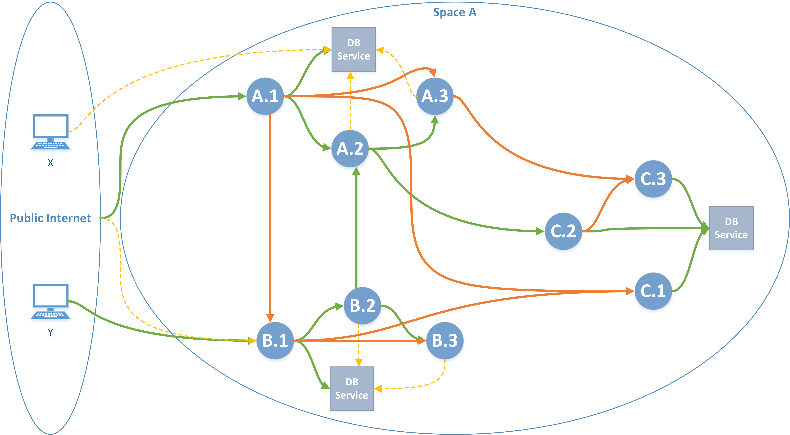

Figure 1 - Application communication in a Cloud Foundry PaaS without security groups on spaces

If multiple applications are grouped in the same space/security group, it can be difficult to trace back from a firewall rule to the application that actually needs it, but there is already a reduction in attack surface as shown in figure 2. Through the use of three spaces with dedicated security groups, four of the previously shown unnecessary communication patterns have now been prohibited.

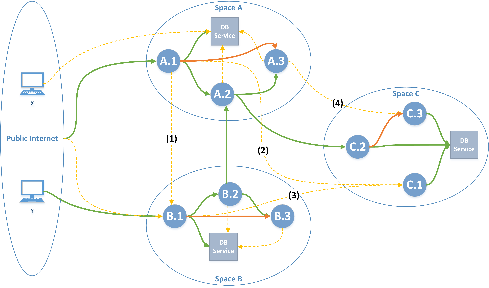

Figure 2 - CF PaaS with a limited spaces configuration

There are certain drawbacks to such a setup. While it is, if you have the right level of information, relatively easy to “just consume” services, it is still a creative process to group applications in an intelligent way.

In a more traditional deployment type, the situation presents itself similarly. Once the process of intelligent grouping of systems (also called “network zoning”) has been performed, the problems usually start. It begins with the question on where to place servers with their applications, how they really communicate over zone boundaries and does not just end with decommissioning of these systems but should also include the disabling of security rules. In the author’s experience, project teams spend a considerable amount of time in the process of applying for firewall rules. Due to the time it takes to acquire and order these rules within a large organisation, it is often the case that the rules are already outdated the moment they have been established and might need an update due to organisational changes or other deployments. Depending on the organisation, the time needed for processing these requests can take from hours to weeks. On the other hand, firewall admins have to manage complex rulesets over time which quite often leads to cluttered and sometimes unnecessary allow-rules.

Although network firewalls exist since the late 80’s , there is only very little information available about the operational cost of these devices and their necessary processes. From an academic point of view, this question doesn’t seem to get a lot of attention. Papers on this topic can mainly be found from privately held companies in the field of firewall automation. Algosec, a company specialized on automation and orchestration of firewalls, states in its 2014 “State of Network Security” report that “two-thirds of respondents reported that manual processes, limited visibility into security policies and poor change management practices posed the greatest challenge to effective management of network security devices”. Older studies, such as the one from 2012 showed similar results. Another study, conducted by firewall workflow automation specialist FireMon, states that API integration for Firewalls is getting more important . Although not scientifically backed, the author in general agrees with these statements and feels that there is need for further automation, especially at the early stage of software development.

Idea description
-------------------------------------------------------------------------------------------------------------------------------------------------------------

This dissertation explores a way to address these problems by phrasing a draft for a domain-specific language and a protocol which lets applications propagate their communication demands to an unknown underlying network. The author assumes that the one who knows best about an application’s communication needs is the one who builds the application. Even though he may not know the details of how the underlying protocols work and how the network topology looks like, he has a strong interest in rapid deployment and enablement of his application but should still want to maintain reasonable security on the various layers.

The language shall be applicable to similar domains that care about prior propagation of communication demands. For example, an application running on a desktop machine could state its needs towards the operating system or a host-based firewall which would then enforce communication according to the requested pattern. In the previously mentioned PaaS case, it would greatly simplify the process if the application could be deployed with a simple description of its communication demands and the Cloud Management platform would then enforce this policy automatically, regardless of whether it is bound to an externally-defined Security Group. This leads us to establish the following objectives:

1.  Speed up the process of firewall change management through automation.

2.  Increase the integrity of firewall rules by keeping track of application lifecycles from first start until final decommissioning.

3.  Ensure that requirements for professional environments such as security requirements are met.

4.  Make the adaptation of describing communication demands as simple as possible for application developers.

5.  Design the solution in such a way that it can be adopted for different use cases by letting implementers extend the language and choose different ways or protocols to propagate communication demands.

To the knowledge of the author, there is no such protocol or definition which addresses these requirements already at the programming stage. The protocol suite is named Application Communication Demands Protocol (ACDP).

Document Structure
----------------------------------------------------------------------------------------------------------------

Besides this introduction into the problem area, the section titled “Background research” provides additional information about existing protocols and, more generally, areas of interest that intersect with the topic of this dissertation.

The section “Project work” consists of the main parts of this dissertation. It first describes the requirements in greater detail, lays out a reference architecture and then describes the language and the protocol in detail. Last but not least, it describes the proof of concept code and a network setup which has been developed for this dissertation.

“Analysis and discussion” evaluates the benefits and shortcomings of the described solution approach and proposes the next steps for this proposal to be adopted in the community.

The "Appendix” includes acknowledgements and the bibliography.

All references in this document are written with IEEE citation style .

Background research
===============================================================================================================================================================================================================

Software defined networking
-------------------------------------------------------------------------------------------------------------------------

Software defined networking (SDN) is a term that evolved in recent years and in its basic form describes an architecture to decouple the network control and forwarding functions . With the use of SDN, network control can be programmatically configured and allows for the abstraction of underlying infrastructure from applications. Figure 3 shows a logical view of the SDN architecture. The control layer in the middle maintains a global view of the network. Through “southbound” interfaces, SDN controllers define the way how network devices are configured and thus how the network behaves.

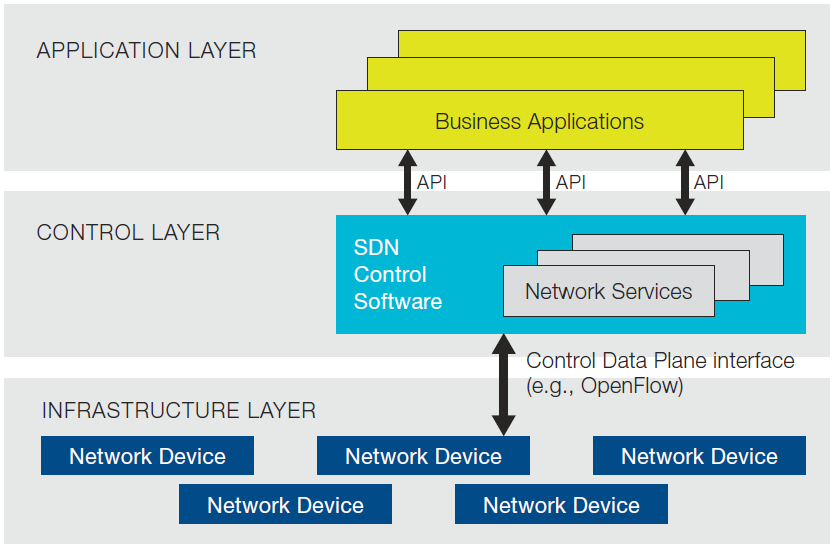

Figure 3 - SDN Architecture from

One aspect of SDN relevant to this dissertation is the use of so-called “northbound” interfaces. These interfaces are meant to communicate between the applications and the SDN controllers which in turn control the infrastructure layer. As described in an article on , northbound APIs are not yet fully specified:

> Because they are so critical, northbound APIs must support a wide variety of applications, so one size will likely not fit all. This is possibly why SDN northbound APIs are currently the most nebulous component in a SDN environment

This dissertation compares to SDN in many ways. From the above definitions point of view, the described idea can be seen as a specific type of northbound API. However, the methods described herein focus on the needs of an application developer rather than the APIs on the control layer consumed by applications. What is described in the above figure as a business application could in fact be any component with communication needs in the scope of this dissertation. The idea described in this dissertation resides entirely within the SDN application layer but may serve as an input source to the SDN northbound APIs.

Automation and Orchestration
--------------------------------------------------------------------------------------------------------------------------

Networks consist of a control, a data and a management plane on a functional level. There are different definitions available and some ambiguities with similar terms, but a paper of Gartner sums up most of the information relevant for this chapter. According to their definition, the management plane is used to set up long-term network configuration. The data plane is merely concerned with forwarding of packets based on its forwarding table (which is sometimes specified as a separate “Forwarding plane”). The control plane is concerned with the calculation of the network path. The topics of network automation and orchestration are closely related to SDN but are not necessarily the same. Network automation provides functions to externally program a network device.

Most modern and commercial network devices and network firewalls provide APIs to enable network programmability. These interfaces are designed to be consumed by orchestration platforms and can be invoked either by a human or a machine. The benefits of using these interfaces is that they allow both read and modification possibilities of both the management and control plane of a network. Devices can be of physical or virtual nature. With such an interface, a firewall can be configured automatically by a central orchestration system.

Interestingly, on higher layers, the automation possibilities are not as developed as one would expect. Only a few of the Web Application Firewalls on the market can be automated in regard to their core functions. This may be due to the fact that, the higher up you look at the layers, the more variety in terms of technologies and protocols can be found. In contrast, on layers 3 and 4, there is only a handful of protocols which are highly standardized and are thus easier to automate.

The previously described idea would fit in with existing network orchestration tools. These could benefit from information transmitted from the applications to further automate the configuration of network and security equipment. De-centralized architectures may also profit from such a protocol. For example, a load-balancer in a remote network might use propagated application information to automatically set up load balancing for an application without any manual intervention.

A company called „Tufin“, as part of their “SecureApp” solution, provides a graphical editor which lets you define application’s network connectivity requirements . It serves as a layer of abstraction because it allows a user to define connectivity requirements without knowing anything about the underlying network. Such information is then passed on to their network automation software called “SecureChange”, which in turn configures firewalls and routers through their programmable interfaces. The effect of the manual definition of applications is very similar to what this dissertation introduces, but varies in the problem it wants to address. While it is certainly a beneficial approach for many companies, there is still the necessity of defining the applications manually. The protocol described in this paper could serve as an input source to such a tool, which together with an orchestration software such as Tufin’s Orchestration Suite could fully automate the whole process.

Discovery Protocols
-----------------------------------------------------------------------------------------------------------------

This chapter investigates existing standards in the area of research. There are a number of technologies which are related to ACDP in a way. Although the specifics of ACDP are only later described, this chapter already discusses similarities and differences between the existing technology and the protocol described later in this paper.

Universal Plug and Play combines a number of different IP-based technologies to facilitate communication among a variety of networked devices. It is mainly used in residential networks to let devices automatically discover each other and specify their capabilities. It is widely deployed and can serve many purposes, but it was not intended for, nor ever gained traction in the enterprise market. ACDP in contrast would be designed to primarily support professional environments. Sources for the claims made in this chapter regarding UPnP can be found in and .

ACDP and UPnP are similar in that they both rely on an IP stack to be available before the protocols take effect. UPnP uses a network discovery protocol called “Simple Service Discovery Protocol” SSDP which sends basic information in a “discovery message” about itself to so-called “control points”. ACDP plans to use a multi-step discovery process which also includes Multicast, depending on the configuration even in an unencrypted manner, but can easily be configured by an application developer according to the needs of the environment. Due to the way how UPnP works, every device needs to have additional network listeners which can be queried from the control points. These listeners can have vulnerabilities, as shown in or . ACDP tries to avoid the introduction of new listeners because they could interfere with the application’s own communication behaviour and because of the security risks associated with it. Instead, it is a purely “outbound” communication model which should be easier to understand and maintain compared to how UPnP communicates in the network.

The UPnP specification is quite large and due to lots of extensions, it became a multi-purpose protocol for lots of different use cases. While ACDP also tries to achieve extensibility, its focus should remain on the formal description and distribution of various communication needs. Another distinction can be made because UPnP doesn’t have a proper notion of applications but focuses on devices. In terms of data representation, UPnP relies heavily on XML, while ACDP relies on JSON representation which has less descriptive overhead and can be easier read by humans.

As defined above, ACDP should be able to send communication demands to either a known or an unknown underlying network. Some method of determining a receiving endpoint should be used. There are a number of existing protocols, which the author of this dissertation doesn’t understand in detail. The Wikipedia article on “Service Discovery” lists, among others the above-mentioned SSDP. Another well-known protocol is DHCP, which allows for automatic IP addressing. On the upper layers, noteworthy protocols are UDDI or WPAD. In fact, WPAD has some similarities to the multi-step discovery algorithm described later in this dissertation.

Existing discovery protocols all have their weaknesses and strengths and ACDP partially tries to address some of the weaknesses. However, due to the huge amount of information regarding these protocols, the author decided to instead focus on a few simple concepts which will be understood by implementers that don’t know much about networking. Additionally, the descriptive language is basically independent of the discovery protocol and could thus later on quite easily be changed.

Cloud Services
------------------------------------------------------------------------------------------------------------

Cloud services usually provide APIs to assign network layer protection to instances. On the infrastructure layer (IaaS) all of the big players in the industry provide such methods. For example, on Amazon Web Services (AWS) EC2 instances, each network interface can be assigned up to 5 security groups. These groups can be easily configured through an API and AWS provides SDKs for different programming languages. Similarly, Microsoft allows to secure VM instances through Network Security Groups. They also provide programmatic access to these features . The Google compute Engine has very similar features . Some of these systems only allow to configure either inbound or outbound rules. It can also be observed that some of the proposed settings mainly focus on isolation from the public Internet, but not from internal attacks. Regardless of the cloud provider, all of the mechanisms and APIs have in common that they need to be configured based on information which has been supplied in other ways, mostly through manual processes.

A look at the “PaaS” layer (platform as a service) shows that most of the network security features rely on the features of the underlying infrastructure layer. For example, in AWS Elastic Beanstalk, security groups are still configured on the EC2 instance layer. The previously mentioned security groups in a CloudFoundry deployment are a bit different. Probably because of its relative independence of the underlying infrastructure, the traffic is usually routed out of the container back over a load-balancer to another container.

Description of communication patterns
-----------------------------------------------------------------------------------------------------------------------------------

From the author’s point of view it is desirable that a common language would be available to describe communication patterns in TCP/IP networks. This would allow for automation, to verify the correctness of the various implementations and would certainly also help to speed up the availability of common SDN patterns for network security equipment. The research shows that some attempts have been made at inventing higher-level languages for firewalls and other network equipment, more generically called “network programming languages”. Probably the best overview of this can be found in . Most notable are the frenetic project and some interesting approaches to firewall rule abstraction like Shorewall and the uncomplicated firewall “UFW” .

It can be observed, especially when looking at , that there is some activity happening on this topic both in academia and the industry. The author of this dissertation assumes that a lot of this activity is caused by the need for automation by the large-scale use of cloud computing. ACDP takes a slightly different approach than most of these papers or tools. It doesn’t emphasize the infrastructure itself but instead focuses on the application which should, with ACDP, describe its communication needs. This application-centric approach should contain just enough information to derive infrastructure configuration. The company Cisco presents a similar approach in its “Application Centric Infrastructure” . Although their approach focuses on applications, it doesn’t seem to include a similar meta-level description language which can be “built in” to applications. Nevertheless, the notion and nature of “application-centric” between Cisco’s approach and the one proposed in this dissertation are somehow related.

DevOps
----------------------------------------------------------------------------------------------------

DevOps is a popular term which aims at bringing various functions in an IT lifecycle closer together. Developers get closer to operations personnel, operations get closer to developers. From the author’s point of view, it is also often used in conjunction with bringing infrastructure topics closer to people who previously had very little to do with it. ACDP influences the behaviour of underlying infrastructure and it may well be seen as a foundation which could help bringing “more DevOps” into the network security realm.

Project work
=========================================================================================================================================================

Reference architecture
--------------------------------------------------------------------------------------------------------------------

This chapter describes the building blocks of the Application Communication Demands Protocol (ACDP). It can be thought of as a model which is used throughout this chapter. On this level of abstraction, ACDP is an architectural framework for distributing communication needs of applications in a networked environment. Components and interfaces are introduced which are then later described with more detailed requirements.

### ACDP components

Please note the use of capitalization to avoid disambiguation of the following terms. They are used as proper nouns throughout this dissertation. All of these terms can be prepended with ACDP (e.g. ACDP Request) to avoid misunderstandings when used in another context.

Demand

A Demand is a formal description of an application’s communication needs in an IP network. One or more Demands are transmitted through a Request by a Submitter over an IP network and interpreted by a Receiver.

Request

A request contains information about an application’s communication demands, i.e. contains a number of ACDP Demands and additional information about the Submitter’s environment.

Response

Although ACDP only optionally responds to Requests, a Response may be given from a Receiver to a Submitter over the SR interface.

Wrapper

An ACDP Wrapper message can contain Requests or Responses. It is used to convey information in a different format. For example, the Wrapper can be used to encrypt an ACDP Request.

Submitter

As the name suggests, the Submitter is responsible for sending out information about an application’s Demands. Multiple Submitters may exist in any given network environment. It is usually integrated as a library into an ACDP-enabled Application and thus provides the APIs to an application developer to make use of ACDP.

Receiver

The Receiver handles parsing and validation of transmitted Demands and may either pass them on to a Controller or to an Enforcer, depending on their capabilities and the environment. Multiple Receivers may exist in any given network environment.

Enforcer

The Enforcer provides functions to restrict or enable communication in a distributed environment. It is usually instructed through an API to act upon a communication need. An Enforcer role can be implemented on various systems, such as network firewalls, host-based firewalls, load balancers, NAT devices, reverse proxies or web application firewalls. Enforcers usually reside between or in front of applications on the data plane. The term is derived from the word “security enforcement point”.

Controller

The Controller is a function in the network which facilitates automation and orchestration over a number of devices. Typically, this can be an SDN controller or any other software which has control over the configuration of networked entities.

Network Object

Any entity participating in an IP network is abstracted by one or multiple IP addresses. A Network Object usually represents devices or machines, which in turn may be operated by a human user. It is expected that in most cases relevant for ACDP they will not have direct human interaction. Network Objects can be described in different ways such as a single IP address, an IP range or a subnet mask.

Application

An Application in the context of this dissertation is used as the term to describe a generic piece of software with communication needs on an IP network. Although the term “program” would, from a technological point of view, more accurately describe the intended use, the term “application” seems to be a more natural choice for many programmers. Thus, the term should not be interpreted purely in the way how desktop or mobile applications usually interact with a user, but more generally as an entity which is made of code. This could also mean that an ACDP Application could just be part of a group of applications, some library code or just a specific method within a bigger piece of code. An Application can exist several times in the form of instances at any given point in time. In the context of this work, Applications are always bound to a Network Object.

Producer

A Producer is the specific case when an Application produces services for consumption by Consumers through a Network Object. An application developer can describe his role as a Producer of services within a Demand.

Consumer

A Consumer is the specific case when an Application consumes services from another Producer through a Network Object. An application developer can describe his role as a Consumer of services within a Demand.

### ACDP interfaces

Submitter-Receiver (SR)

The SR interface between the Submitter and the Receiver is responsible for transmission of ACDP Requests. The Receiver may be at first unknown to the Submitter. Implementation of this interface is mandatory for a working ACDP environment.

Receiver-Controller (RC)

The RC interface passes information about Demands from the Receiver to one or more known Controllers with a language provided by the Controller. Implementation of this interface is optional for a functioning ACDP environment but highly encouraged for large-scale deployments. The RC interface is intended to delegate control over configuration to an orchestration system which may provide additional levels of control. For example, a Controller may require additional manual control or modification steps before a Demand can be fulfilled by an Enforcer.

Receiver-Enforcer (RE)

The RE interface sends Demands to one or more known Enforcers based on information found in the received Demands. The language must be provided by the Enforcer. Implementation of this interface is optional for a functioning ACDP environment but may provide the fastest response rate to fulfil Demands. The intention of the RE interface is the automatic fulfilment of Demands without further orchestration. For example, an application may demand to consume another application and such a Demand would immediately be configured on an Enforcer by the Receiver which received the Request.

Controller-Enforcer (CE)

The CE interface configures one or more known Enforcers with applied transformation and orchestration rules. The language must be provided by the Enforcer. Implementation of this interface is optional for a functioning ACDP environment but may provide the highest degree of accuracy and functionality.

Consumer-Producer (CP)

The CP interface is an abstract representation of any communication which can happen between two applications. One of these two applications needs to be an ACDP-enabled Application for a functioning ACDP environment. Such an interface is usually bound to the data plane in a network environment and can be seen as the “payload” transmitted between applications. It needs to be mentioned that the CP interface is not only concerned about communication between machines but also about communication between humans and machines through applications. For example, an internet browser may act as a Submitter to request a Demand on behalf of an end user.

### ACDP overview and scope of responsibility

Figure 4 depicts the ACDP architecture with the components and interfaces as defined above. ACDP’s only direct responsibility is the definition of the ACDP Request, the SR interface and the behaviour of the Submitter and Receiver. However, certain requirements may be imposed to other interfaces or the environment where ACDP is used, hence the need for describing the neighbour interfaces RC, RE and CE.

The Submitter and Receiver components as laid out in the architectural overview should not implement any other interfaces than the ones defined below. Following this rule offers the advantage that a certain degree of standardization can be achieved.

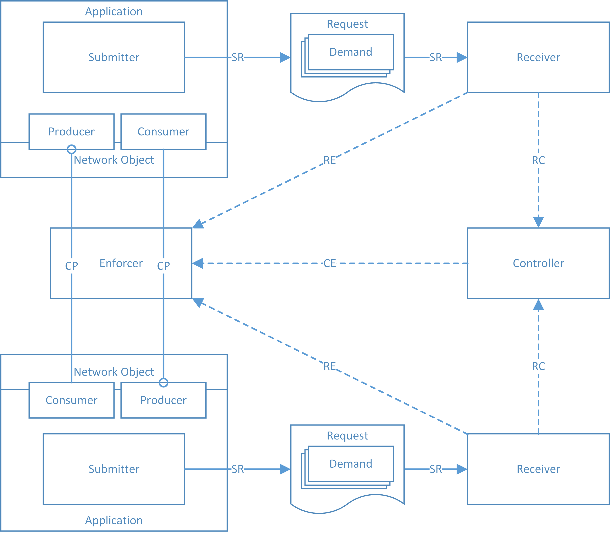

Figure 4 - ACDP Architectural Overview

Detail specification
------------------------------------------------------------------------------------------------------------------

Based on the high-level requirements in chapter 1.2 and the architecture depicted above, this chapter describes the detailed requirements which any ACDP implementation must follow. Where necessary, it also describes why a decision has been made to do it the described way and not in another way.

The key words "MUST", "MUST NOT", "REQUIRED", "SHALL", "SHALL NOT", "SHOULD", "SHOULD NOT", "RECOMMENDED", "MAY", and "OPTIONAL" in this chapter are to be interpreted as described in IETF RFC 2119 .

ACDP uses three message types, the ACDP Request, the ACDP Response and the ACDP Wrapper message. All of these messages are encoded using UTF-8. The format in use adheres to the specifications laid out in RFC 4627 . JavaScript Object Notation (JSON), and the terms object, name, value, array, and number, are used as defined in this RFC. JSON has been chosen because it is more compact than XML and in the view of the author more readable. JSON is also well supported, parsers are available for most programming languages. Other data representation schemes are not intended for use with ACDP. For the relatively complex ACDP Request message, a JSON Schema has been designed to validate Requests. For the other two message types, a JSON Schema has not yet been designed.

The ACDP messages follow as best as they can the Google JSON Style Guide . In the ACDP message specifications, an object consists of a collection of name/value pairs -- also called a property. The property thus simply consists of a property name and a property value. For each property, the name is always a string. Property values are either a string, number, object, array or one of the literals: true, false, and null. The term ‘property of type’ refers to the specification of an object. An array consists of elements where each element is a value as described in the corresponding section.

The objects necessary to compose such messages are described in the following chapters in the style of an RFC and always include an example. Only valid examples are shown. Surrounding brackets of the object under specification have been omitted for the sake of brevity. Child objects or values are abbreviated with “…”, where it seems to be necessary for readability.

All object names and enums are case sensitive. In general, values which are not specifically defined must be treated as case sensitive. For example, an identifier such as “aa61848d-ce45-4b2e-9bce-f0c6e34f4c63” is different from “AA61848D-CE45-4B2E-9BCE-F0C6E34F4C63”. ACDP libraries which create identifiers and similar unique values should automatically convert them to lowercase.

### ACDP Request message

To achieve the goal of speeding up the process of firewall change management, a common language is established which allows the description of communication patterns in a networked environment from an application’s point of view. The language has been designed to be easily understandable. This should help to promote rapid adaptation for different environments and programming languages.

An ACDP Request represents a collection of communication demands. The JSON data structure as described in this chapter needs to be validated by a Receiver. The ACDP Request Schema enforces such a format and is an integral part of this specification. A description of the schema can be found in chapter 3.2.1.10.

#### Request object

An ACDP Request always consists of a single object at the root level. This ACDP *request* object holds information about the Submitter and one or more communication demands.

-   The request object must have a property with the name “type” and a value of “ACDPREQUEST”

-   The request object must have a property of type [submitter].

-   The request object must have a property of type [demands].

-   The request object must not have any other properties.

Example

    {
      "type": "ACDPREQUEST",
      "submitter": {
        "...": "..."
      },
      "demands": [
        "..."
      ]
    }

#### Submitter object

The *submitter* is an object which describes the environment of the sender of the Request. In most cases, the values in this object would be determined by the library from which a request is sent.

-   The *submitter* object should have a property with the name “description”. This property’s value must be a string that determines the sender’s properties, e.g. the ACDP Submitter’s platform and version number.

-   The *submitter* object should have a property with the name “endpoint”. The endpoint’s value, if used within the Submitter object, is an object which must have a property of type [networkEndpoint]. It describes the Submitter’s local IP address(es) as the Submitter sees it.

-   The *submitter* object must not have any other properties.

Examples

    {
      "submitter": {
        "description": "Node.js Submitter version 0.1.0",
      }
    }

    {
      "submitter": {
        "description": "Node.js Submitter version 0.1.0",
        "endpoint": {
          "networkEndpoint": {
            "ipAddresses": [
              "192.168.2.42",
              "192.168.1.42"
            ]
          }
        }
      }
    }

#### Demands object

A *demands* object contains a list of objects which describe the communication needs of an application.

-   The *demands* object must have a value of type array. This array must have at least one property of type [producer] or [consumer].

-   Each property in the array must be unique.

Examples

    {
      "demands": [
        {
          "producer": {
            "...": "..."
          }
        },
        {
          "consumer": {
            "...": "...a..."
          }
        },
        {
          "consumer": {
            "...": "...b..."
          }
        }
      ]
    }

#### Producer object

A *producer* object holds the definition of services which are produced by the application for consumption by other consumers.

-   The *producer* object must have a property of type [application]

-   The *producer* object must have a property of type [produces]

-   The *producer* object must have a property of type [forConsumers]

-   The *producer* object must have a property with the name “id”. This property’s value is a string or a number that identifies a specific *producer* object. The value must be unique within an ACDPREQUEST and it must be unique during the lifetime of an ACDP Submitter process. The value may continue to be the same for a given *producer* object even when an ACDP Submitter process restarts.

-   The *producer* object should have a property with the name “description”. This property’s value is a string that describes the Producer’s intent, e.g. the offering of an interface.

-   The *producer* object must not have any other properties.

Example

    {
      "producer": {
        "description": "Listener for the default webservice interface",
        "id": "cb4f3e25-d08b-4420-a337-78fabcc800ab",
        "application": {
          "...": "..."
        },
        "produces": [
          {
            "...": "..."
          }
        ],
        "forConsumers": [
          {
            "...": "..."
          }
        ]
      }
    }

##### Produces object

A *produces* object contains a list of objects which describe the endpoints of an application.

-   The *produces* object must only be valid when it is a property of the [producer] object. Please note that this can only be implicitly enforced through a stringent definition of the whole ACDP Request schema.

-   The *produces* object must have a value of type array. This array must have at least one property of type [endpoint]

-   The endpoints in the produces array must be of type [transportEndpoint]

-   The objects in the *produces* array must not have any other properties.

-   Each property in the array must be unique.

Example

    {
      "produces": [
        {
          "endpoint": {
            "transportEndpoint": {
              "...": "..."
            }
          },
          "endpoint": {
            "transportEndpoint": {
              "ports": [
                {
                  "type": "TCP",
                  "number": 443
                },
                {
                  "type": "TCP",
                  "number": 80
                }
              ]
            }
          }
        }
      ]
    }

##### ForConsumers object

The *forConsumers* object contains a list of endpoints which might want to consume services provided by this application. It usually consists of hostnames or applications and thus describes endpoints which can be identified on layer 3.

-   The *forConsumers* object must only be valid when it is a property of the [producer] object

-   The *forConsumers* object must have a value of type array. This array must have at least one property of type [endpoint]

-   The endpoints in the *forConsumers* array must be of the type [networkEndpoint] or [applicationEndpoint]

-   The objects in the *forConsumers* array must not have any other properties

-   Each property in the array must be unique.

Example

    {
      "forConsumers": [
        {
          "endpoint": {
            "applicationEndpoint": {
              "applications": [
                {
                  "application": "..."
                }
              ]
            }
          }
        }
      ]
    }

#### Consumer object

A *consumer* object holds the definition of services which are produced by other applications for consumption by this application.

-   The *consumer* object must have a property of type [application].

-   The *consumer* object must have a property of type [consumes].

-   The *consumer* object must have a property of type [fromProducers].

-   The *consumer* object must have a property with the name “id”. This property’s value is a string or a number that identifies a specific consumer. The value must be unique within an ACDPREQUEST and it must be unique during the lifetime of an ACDP Submitter process. The value may continue to be the same for a given *consumer* object even when an ACDP Submitter process restarts.

-   The *consumer* object should have a property with the name “description”. This property’s value is a string that describes the Consumer’s intent, e.g. the consumption of an interface.

-   The *consumer* object must not have any other properties.

Example

    {
      "consumer": {
        "description": "consumption of the google apis",
        "id": "3c166cbb-c4de-405e-b5df-2186893b28d2",
        "application": {
          "...": "..."
        },
        "consumes": [
          {
            "...": "..."
          }
        ],
        "fromProducers": [
          {
            "...": "..."
          }
        ]
      }
    }

##### Consumes object

A *consumes* object contains a list of objects which describe the endpoints that this application wishes to consume.

-   The *consumes* object must only be valid when it is a property of the [consumer] object.

-   The *consumes* object must have a value of type array. This array must have at least one property of type [endpoint]

-   The endpoints in the *consumes* array must be of the type [transportEndpoint] or [applicationEndpoint]

-   The *consumes* array must not have any other properties

-   Each property in the array must be unique.

Example

    {
      "consumes": [
        {
          "endpoint": {
            "transportEndpoint": {
              "ports": [
                "..."
              ]
            }
          }
        }
      ]
    }

##### FromProducers object

The *fromProducers* object contains a list of endpoints which this application wants to consume. It usually consists of hostnames or applications and thus describes endpoints which can be identified on layer 3.

-   The *fromProducers* object must only be valid when it is a property of the [consumer] object.

-   The *fromProducers* object must have a value of type array. This array must have at least one property of type [endpoint]

-   The endpoints in the *fromProducers* array must be of the type [networkEndpoint] or [applicationEndpoint]

-   The *fromProducers* array must not have any other properties

-   Each property in the array must be unique.

Example

    {
      "fromProducers": [
        {
          "endpoint": {
            "applicationEndpoint": {
              "applications": [
                {
                  "application": {
                    "applicationid": "..."
                  }
                }
              ]
            }
          }
        }
      ]
    }

#### Application object

The *application* object describes an application in a generic way. The values of an application are usually determined by the library, but may be overridden by a library user.

-   The *application* object must have a property with the name “applicationid”. This property’s value is a string or a number that determines the application’s universally unique identifier, e.g. the UUID v4 of an application.

-   The *application* object should have a property with the name “instanceid”. This property’s value is a string or a number that determines the application’s instance identifier which spans the lifetime of a process. This value must be automatically chosen by the ACDP Submitter library.

-   The *application* object may have a property with the name “componentid”. This property’s value is a string or a number that determines the component within a larger program which generates communication demands. This value must not be chosen by the ACDP Submitter library but by the user of the library.

-   The *application* object should have a property with the name “applicationname”. This property’s value is a string that should describe the application’s name.

-   The *application* object should have a property with the name “applicationversion”. This property’s value is a string that should describe the application’s version number.

-   The *application* object should have a member with the name “description”. This property’s value is a string that should describe the application’s intended use.

-   The *application* object may have other custom properties.

-   The *application* object may itself be an [applicationEndpoint].

Example

    {
      "application": {
        "applicationid": "123456789",
        "instanceid": "567890",
        "componentid": "http helper library",
        "applicationname": "ABC Web Application Frontend",
        "applicationversion": "1.0.1",
        "description": "This is a sample application"
      }
    }

#### Endpoint object

The *endpoint* object is a wrapper to describe different types of endpoints.

-   The *endpoint* object must have at least one property of the type [networkEndpoint], [transportEndpoint] or [applicationEndpoint]

-   The *endpoint* object must not have any other properties.

Note: The endpoint object itself is not used or enforced in the Schema. The schema only references to the final endpoint type through the context of where it is used, e.g. through the [transportEndpoint][1] in the [consumes][2] object. Due to this context-sensitivity of the *endpoint* object, quite a bit of additional description is necessary in the schema.

Examples

    {
      "endpoint": {
        "networkEndpoint": {
          "ipAddresses": [
            "5.6.7.8",
            "1.2.3.4/20"
          ]
        }
      }
    }

    {
      "endpoint": {
        "transportEndpoint": {
          "ports": [
            {
              "type": "TCP",
              "number": 443
            },
            {
              "type": "TCP",
              "number": 80
            }
          ]
        }
      }
    }

    {
      "endpoint": {
        "applicationEndpoint": {
          "applications": [
            {
              "application": {
                "applicationid": "987654321"
              }
            }
          ]
        }
      }
    }

##### NetworkEndpoint object

An endpoint of this type describes a host on a private or public network which is identifiable either through an IP address or a fully qualified domain name.

-   The *networkEndpoint* object must have only one property of either type [ipAddresses] or [fdqNames] or [special]

Examples

    {
      "networkEndpoint": {
        "ipAddresses": [
          "..."
        ]
      }
    }

    {
      "networkEndpoint": {
        "fqdNames": [
          "..."
        ]
      }
    }

    {
      "special": {
        "type": {
          "type": "ANY"
        }
      }
    }

##### TransportEndpoint object

An endpoint of this type describes an endpoint on layer 4 which is identifiable through the string TCP or UDP or SCTP in combination with a port number.

-   The *transportEndpoint* object must have only one property of type [ports] or [special]

Example

    {
      "transportEndpoint": {
        "ports": [
          {
            "type": "TCP",
            "number": 443
          }
        ]
      }
    }

    {
      "transportEndpoint": {
        "special": {
          "type": {
            "type": "ANY"
          }
        }
      }
    }

##### ApplicationEndpoint object

An *applicationEndpoint* object is an endpoint which is predefined for additional definitions later to be added to the schema such as URLs. In its current definition it may only contain an array of applications. Or of the special types.

-   The *applicationEndpoint* object must have only one property of either name “applications” or type [special]

-   The *applications* property must have a value of type array. This array must have at least one property of type [application][3].

-   Each property in the *applications* array must be unique.

Examples

    {
      "applicationEndpoint": {
        "applications": [
          {
            "application": {
              "applicationid": "987654321"
            }
          }
        ]
      }
    }

##### CustomEndpoint object

The *customEndpoint* serves as a generic placeholder for future or custom use. Its intention is to serve as a placeholder for describing any thinkable endpoint on any layer. An implementer is free to use this endpoint object wherever it is allowed to do so. However, the customEndpoint shall not be used to convey or enrich information which is intended to be transported in one of the other endpoints. Please note that although the customEndpoint has its place in the schema and could be accessed using a JSON pointer, it is of no real use currently because it is not included in one of the [Producer][producer] or [Consumer][consumer] objects. This should be addressed in a future release of the schema.

Examples

    {
      "customEndpoint": {
        "customObject": {
          "something": {
            "youChoose": "a value",
            "orMaybe": [
              "an",
              "array"
            ],
            "howAbout": {
              "a nested object?": {
                "with a key": "with a value."
              }
            }
          }
        }
      }
    }

#### Other objects

##### IpAddresses object

The *ipAddresses* object holds information about IP addresses. It is mainly used within a [networkEndpoint][4] definition.

-   The *ipAddresses* object must have a value of type array. This array must have at least one value of format [IP Address]

-   The *ipAddresses* array must not have any other properties.

-   Each property in the array must be unique.

Example

    {
      "ipAddresses": [
        "5.6.7.8",
        "1.2.3.4/20",
        "10.10.20.1-10.10.20.128"
      ]
    }

##### FqdNames object

The *fqdNames* object holds information about fully qualified domain names.

-   The *fqdNames* object must have a value of type array. This array must have at least one value of format [FQDN].

-   The *fqdNames* array must not have any other properties.

-   Each property in the array must be unique.

-   The ACDP Submitter must perform Punycode translation according to RFC 3492 before the validation of domain names according to the schema is executed

-   The ACDP Submitter must always append the trailing dot of the root zone if it is not present. Otherwise, the fqdn will not evaluate to a correct value.

Examples

    {
      "fqdNames": [
        "*.google.com.",
        "api.google.com.",
        "www.npmjs.com."
      ]
    }

    {
      "fqdNames": [
        "*.xn--marcoschnriger-osb.ch."
      ]
    }

##### Ports object

The *ports* object holds an array of objects which describe layer 4 communication ports.

-   The *ports* object must have a value of type array. This array must have at least one member of type object.

<!-- -->

-   Each member in the array must contain a property with the name “type”. This property’s value is a string of value “TCP” or “UDP” or “SCTP”.

<!-- -->

-   Each member in the array must contain a property with the name “number”. This property’s value is a number value in the range from 0 to 65535.

-   The members in the array must not have any other properties.

-   Each property in the array must be unique.

Example

    {
      "ports": [
        {
          "type": "TCP",
          "number": 443
        },
        {
          "type": "TCP",
          "number": 80
        }
      ]
    }

##### Special object

The *special* object holds a specific object which can be used within other objects. Their type often describes endpoints which are not known at development time, maybe not even at run time. The special type “ANY” expresses that all possible entities in the given context shall be demanded. “UNKNOWN” expresses that not all possible entities shall be demanded, but that at the time of Demand creation the entities were not yet known. These Demands need further inspection and can usually not be directly configured on an Enforcer. “KNOWN” in contrary expresses the Demand that all entities which are already KNOWN (to a Controller or an Enforcer) shall be demanded and could be automatically enforced.

-   The *special* object must have a property value of type object

<!-- -->

-   The member object must contain only one key with the name “type”. This member’s value is a string of value “ANY” or “UNKNOWN” or “KNOWN”.

Examples

    {
      "special": {
        "type": "ANY"
      }
    }

    {
      "special": {
        "type": "UNKNOWN"
      }
    }

    {
      "special": {
        "type": "KNOWN"
      }
    }

#### Formats

For some string values, the ACDP schema enforces the use of a specific notation. These values are checked against a regular expression.

##### IP address format

With the current definition, only IP version 4 addresses are supported. An IP address or a range of IP addresses can be expressed using one of the following schemes (examples have already been provided in the description of the [ipAddresses] object):

1.  An IPv4 single IP in dotted decimal notation according to RFC 3986 .

2.  IPv4 CIDR/subnet notation as specified in RFC 4632 .

3.  IPv4 range which simply starts at a single IP according to 1) to a second IP, again according to 1). The range is denoted with a hyphen (UTF-8 0x2D).

##### FQDN format

In general, the name of the fully-qualified domain name follows RFC 1034 . This includes the trailing dot “.” character at the end of the hostname. Additionally, the FQDN format in the ACDP schema allows the use of the wildcard symbol asterisk “\*” (UTF-8 0x2A). The asterisk symbol can be used anywhere in the hostname or the domain name portion, except for the top level domain. It should not be used other than to replace full host or domain name parts. However, due to specific situations where a wildcard may be needed right within a specific host or domain name, the specification allows to use it in this way.

#### ACDP Request Schema validation

Whenever an ACDP Request is received, the Receiver should be able to validate the syntax and basic semantics of the request. JSON documents don’t need a definition of its structure, but developers found it helpful to validate data against a schema before further processing of the data. On the contrary, schemas are an integral part of any XML data structure.

In the JavaScript world, JSON schema has emerged to address this need. The specification is not yet final, but the v4 draft seems to be stable since about two years. It is split in three parts according to :

-   The JSON Schema Core defines the basic foundation of JSON Schema.

-   The JSON Schema Validation defines the validation keywords.

-   The JSON Hyper-Schema defines the keywords to turn JSON into hyper-text.

Although it is a substantial part of this project, the schema has been moved to the appendix due to its size. Please find the ACDP Request Schema in chapter 5.4. It implements all of the above requirements. However, formal validation of the schema against the textual representation of the specification has not been performed and should be done at a later stage.

The schema has been designed without the use of the JSON Schema “format” specification because many implementations do not yet support this keyword. Instead, whenever semantics are crucial for ACDP, regular expressions have been defined on primitives. The schema has been designed to be self-contained and makes heavy use of JSON pointers for the definitions of the objects. This may slow down validation, but tests have shown that validation for a single Demand is still within an acceptable level. Supplying for example four almost identical Demands takes approximately 15ms and thus doesn’t seem to linearly or exponentially increase calculation time. The tests have been performed with the tv4 node.js package .

### ACDP Response message

In case of bidirectional communication, the Submitter should get a response from the Receiver. The response is, due to the basic asynchronous nature of the protocol, very simple. No delivery guarantees can be expected by a Submitter, but the Receiver may communicate in a response about the status of a Request.

#### Response object

An ACDP Response always consists of a single object at the root level. This ACDP Response object holds information about the Receiver and one or more communication demands.

-   The *response* object must have a property with the name “type” and a value of “ACDPRESPONSE”

-   The *response* object must have a property of type [receiver].

-   The *response* object should have a property of type [demands][5]. If the Request was invalid according to the ACDP Request Schema, the *demands* object should be omitted. If the Request was valid, the *demands* object must be supplied.

-   The *response* object must have a property of type [request].

-   The *response* object must not have any other properties.

Example

    {
      "type": "ACDPRESPONSE",
      "receiver": {
        "description": "Company-wide ACDP Receiver."
      },
      "request": {
        "state": "VALID"
      },
      "demands": [
        {
          "id": "aa61848d-ce45-4b2e-9bce-f0c6e34f4c64",
          "state": "RECEIVED"
        },
        {
          "id": "aa61848d-ce45-4b2e-9bce-f0c6e34f4c63",
          "state": "RECEIVED"
        },
        {
          "id": "aa61848d-ce45-4b2e-9bce-f0c6e34f4c62",
          "state": "RECEIVED"
        },
        {
          "id": "aa61848d-ce45-4b2e-9bce-f0c6e34f4c61",
          "state": "RECEIVED"
        }
      ]
    }

    {
      "type": "ACDPRESPONSE",
      "receiver": {
        "description": "Company-wide ACDP Receiver."
      },
      "request": {
        "state": "VALID"
      },
    }

#### Receiver object

The *receiver* object describes the environment of the ACDP Receiver. In most cases, the values in this object would be determined by the library from which a response is sent.

-   The *receiver* object should have a property with the name “description”. This property’s value must be a string that determines the receiver’s properties, e.g. the ACDP Receiver’s scope of responsibility.

-   The *receiver* object must not have any other properties.

Examples

    {
      "receiver": {
        "description": "Company-wide ACDP receiver",
      }
    }

#### Demands object

A *demands* object within an ACDPRESPONSE contains a list of objects which describe the implementation state of previously demanded communication needs.

-   The *demands* object must have a value of type array. This array must have at least one property which must be an object.

-   Each object must have a property with the name “id”. This property’s value must be a string or a number which refers to the id used in a corresponding ACDPREQUEST

-   Each object must have a property with the name “state”. This property’s value is a string of value “RECEIVED”, “IMPLEMENTED” or “PROHIBITED”.

-   Each property in the array must be unique.

Examples

    {
      "demands": [
        {
          "id": "cb4f3e25-d08b-4420-a337-78fabcc800ab",
          "state": "IMPLEMENTED"
        },
        {
          "id": "3c166cbb-c4de-405e-b5df-2186893b28d2",
          "state": "RECEIVED"
        }
      ]
    }

#### Request object

The *request* object describes the state of the ACDP Request as it was received and validated against the Receiver.

-   The *request* object should have a property with the name “state”. This property’s value is a string of value “VALID” or “INVALID”.

-   The *request* object must not have any other properties.

Examples

    {
      "request": {
        "state": "VALID"
      }
    }

### ACDP Wrapper message

The ACDP Wrapper message is used to enrich or transform ACDP Request or Response messages into other formats. As the name suggests, it can wrap all other ACDP messages. For the specification in its current draft state, it only supports the use of one cryptographic transform in the form of JSON Web Encryption as specified in RFC 7516 . The basic structure of an ACDP Wrapper allows for future use of other transformations such as the use of different cryptographic representations or, more general, message transformations. Different implementations of ACDP Submitter and Receiver may not support all transformations.

#### Wrapper object

An ACDP Wrapper always consists of a single object at the root level. This ACDP Wrapper object holds a transformation of another ACDP message.

-   The *Wrapper* object must have a property with the name “type” and a value of “ACDPWRAPPER”

-   The W*rapper* object must have only one additional property. In the current draft, the only supported property is of the type [jwe] (which stands for JSON Web Encryption)

-   The *wrapper* object must not have any other properties.

Example

    {
      "type": "ACDPWRAPPER",
      "jwe": {
        "...":"..."
      }
    }

#### Jwe Object

The *jwe* object represents encrypted content according to RFC7516 . Any ACDP Submitter or Receiver implementation must support the AES GCM algorithm with a 256-bit key to produce the ciphertext and the Authentication Tag. Other modes should be supported.

For example, the following JWK symmetric key could be used to initialize an ACDP library:

    {
      "key": {
        "kty": "oct",
        "kid": "gBdaS-G8RLax2qgObTD94w",
        "use": "enc",
        "alg": "A256GCM",
        "k": "GawRLj79dCHEOyGKsDH1B5ww4Iv3WBw54AihTn3GtnQ"
      }
    }

As an example, the following plain text ACDP Request message is taken as an input:

    {
      "type": "ACDPREQUEST",
      "submitter": {
        "description": "ACDP Submitter for Node.js version 0.1.0"
      },
      "demands": [
        {
          "producer": {
            "id": "8060a95c-5ea3-44c1-9c64-4d5f436cda4b",
            "application": {
              "applicationid": "Your unique application ID goes here",
              "instanceid": "0e8eac6a-585f-40ea-9240-5a5bacf2135c"
            },
            "produces": [
              {
                "endpoint": {
                  "transportEndpoint": {
                    "ports": [
                      {
                        "type": "TCP",
                        "number": 443
                      }
                    ]
                  }
                }
              }
            ],
            "forConsumers": [
              {
                "endpoint": {
                  "networkEndpoint": {
                    "special": {
                      "type": "UNKNOWN"
                    }
                  }
                }
              }
            ]
          }
        }
      ]
    }

By applying the JWE transformation with the previously supplied key, the following valid ACDP Wrapper message is generated:

    {
      "type": "ACDPWRAPPER",
      "jwe": {
        "protected": "eyJhbGciOiJkaXIiLCJraWQiOiJnQmRhUy1HOFJMYXgycWdPYlREOTR3IiwiZW5jIjoiQTI1NkdDTSJ9",
        "iv": "ktZtksEy-KBXywp-",
        "ciphertext": "KH2aswbLFlR0GZDxIYNGCOc7H4SIxDP3EtCEvCONuO5WDrs85FTloWpJev-dyzjGsFIerJryveiyA_6wQTR-DFtoFZqcyLSqeyzMRvuFq3_x3Dd1ctoFrVE0Gt2F8fnmYAKoYtyoS_X0WJ8TzSShssDUBEGrgf9aXr_DsYdZv0eUYcDs9z6yUF08MVdChQeDYUFQeOkb2diIl51CKScoThNy5WdIhcDmYg5EI_yL_tD5n3VCXhsjtr_1mg5bO3G9lIK-8KTAE0IWAk6r1WsRyX5TDVXQFw1ZjqaJtF86RceYac4Fm8JZZM2kAAUinGtB2mi47f_JjukUTtHL1SOQroJMJTUxxeZ-FGCJtp1zJ6LKi29BYUfNx6dUZZeZ_sfwL9Jj__D6_fwMGjTonbAP7StRBogWF993lqz4Ja6UgTPOjCaOI8TfcrI5rbcMFOgt6OzD8kBwb19-GiMXwIzDkncDv-Rr26Ug20KqjnN1wym8tY8HJXOVaYguuQQIPCWtY2pj1Ka_TPtNqI8emaGJO1XBV49UFkC_hn54RZzS_kNfeJr_OvN4aCHc_A3MMCn9C_e45uqk5sHOAaYnNN__Q3OeEE00TnwO",
        "tag": "q8hL3oAka0M0iha0RmvgRQ"
      }
    }

The structure of the jwe object is derived from the algorithm and must follow all rules as specified in . A Receiver or Submitter which has access to the key can now, using the initialization vector “iv”, decrypt the ciphertext. The used AES 256 Galois/Counter Mode provides data authenticity and confidentiality . The use of other mechanisms such as asymmetric cryptography can thus be implemented for all ACDP message types. However, ACDP does not specify a mechanism for distributing cryptographic keys.

### SR Interface

The SR interface transmits Requests from a Submitter to a Receiver. Although this sounds relatively easy, it is quite complex because of the requirement that an application developer shouldn’t need to know much about networking. The Submitter may run in totally different network environments where the only thing in common is the use of IP.

Because the SR interface (short: protocol) communicates from the Submitter to the Receiver, these components are referred to in the requirements quite often. The following chapter is an analysis of the different requirements and options which were taken into account before the actual network protocol was chosen (as defined in chapter 3.2.4.2 “Communication protocol”).

#### Evaluation of an appropriate distribution mechanism

##### Requirements

The author envisions an asynchronous communication model. As mentioned before, the basic idea is that a Submitter should just be able to broadcast his Demand to an underlying network without knowing too much about the network itself. This means that a Submitter may not expect to get a response from the unknown network and therefore all kinds of protocols are possible options to support such a use case. However, a Receiver must always be able to see the source IP address of a Demand without relying on information supplied in the ACDP Request. This is important because an Enforcer may need to know the real source IP which is visible from a system in a specific network to provide a working configuration. For example, if the Submitter resides in a network segment which applies network address translation (NAT), and the Receiver is located outside of that network, the optional IP address in the Submitter object of an ACDP Request message (as seen in 3.2.1.2) doesn’t represent the source ip address which possible communication partners outside of that segment will see.

The protocol implementation on the Submitter must not interfere with any application-own network listeners (to avoid port usage conflicts). To reduce attack surface, the implementation should not require to set up any constant network listeners. It must thus not provide an additional inbound interface. All communication must be initiated by the Submitter.

There is no requirement that the network protocol (the transport) itself must provide confidentiality or integrity protection because this, if required, should be implemented on the message layer using an ACDP Wrapper message. The availability of Demands is not of great importance, either. However, if there are facilities available which make it easy to enable these security properties on the network protocol, they should be used because the language has both an encrypted and an unencrypted mode of operation.

The protocol must facilitate the creation and sending of Requests during the whole time an application is running. This is because ACDP Requests can be generated at any time an application is in a running state.

The protocol should be able to be deployed in different networking environments such as private or public networks. The specification as a whole should also cater for environments where layer 3 or layer 4 packet modifications occur (such as Network Address Translation). The protocol should also be able to handle dynamic IP address changes which happen at run time of an application. This implies that for the correct functioning of the protocol, it should not matter if IP addresses are dynamically or statically assigned. The protocol, in its current proof-of-concept phase, must work in an IPv4 network environment and should also work in an IPv6 network.

To evaluate one or more suitable protocols, the author chose to take a look at different routing schemes and discover their advantages and disadvantages in regards to the established requirements. The following description of the routing schemes is cited from and the graphs in this chapter are adapted from that source:

-   broadcast delivers a message to all nodes in the network

-   unicast delivers a message to a single specific node

-   multicast delivers a message to a group of nodes that have expressed interest in receiving the message

-   anycast delivers a message to anyone out of a group of nodes, typically the one nearest to the source

-   geocast delivers a message to a geographic area

##### Broadcast

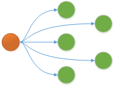

Figure 5 - Broadcast scheme

The Submitter could be implemented with a pure UDP broadcast. It would send messages out to the local network and all hosts in the same broadcast domain would receive the message. An ACDP Request would thus be sent to all hosts in the same subnet, even the ones which are not interested in receiving such messages. The biggest disadvantage from an ACDP point of view is the fact that these messages are contained to a single subnet in a TCP/IP network. To overcome this problem, helpers could be implemented which forward broadcast traffic, a lot like a DHCP helper is configured on a router. However, this would imply that all networks, if they want to transport ACDP requests, need modifications to support this scheme.

##### Unicast

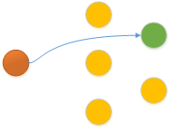

Figure 6 - Unicast scheme

Unicast is what is most common in today’s networking environment. In this scheme, the sender knows about the receiver’s endpoint and builds up a direct connection to this destination. In the case of ACDP, this would mean that an ACDP Submitter needs to know the destination IP address or a DNS name before he can actually send out the Request. However, as we must assume that a developer doesn’t know about the exact environment in which his code will run, it is not easy to specify a defined endpoint. There are a few possibilities to address this problem.

A very simplistic approach would be to just define a globally reserved IP to which a Submitter would try to build up a TCP connection. Although something may actually run on this IP, it would be highly undesirable if all of the ACDP Request traffic would end up there. Thus, some component in the communication path would need to act as if it were that globally reserved IP and receive the ACDP request. This could be implemented similarly to how captive portals in wireless or mobile networks work. However, these configurations often fail when Transport Layer Security is enabled, because this if effectively a kind of a man-in-the-middle-attack.

Another approach to prime the Submitter with the knowledge about a destination would be to just locally configure an IP as its endpoint. Local in that context means that is given to the application from the run-time environment, e.g. through a configuration directive.

Instead of directly using IP addresses, a Submitter could use the name resolution capabilities of its environment. The approach described in the previous paragraph would work with DNS name resolution as well, but the local configuration would still need to be primed with a name to look up. To overcome this problem, a special second-level domain (e.g. acdp-lookup.org) could be reserved which would be configured by DNS administrators that want to make their environment ACDP ready. A dedicated A-record such as receiver.acdp-lookup.org would then always be resolved by a Submitter and would point to the corresponding endpoint in the environment where the ACDP Submitter runs.

The most elegant approach to resolve a name to one or more IP addresses would be the use of DNS Resource Records to perform service discovery as specified in . Instead of looking up a specific hostname, the DNS client portion of the Submitter would use the domain name portion of its runtime environment and perform a lookup for the ACDP service address, e.g. \_acdp.\_tcp.example.com. If the DNS administrator has the SRV Resource record correctly configured, the Submitter would then take the domain portion of its fully qualified domain name (fqdn), for example “company.tld”, prepend the desired service name and get in return a list of valid service endpoints. Depending on the abstraction level of the programming language, it might be difficult to get a valid domain name. Additionally, in some cloud environments the use of public DNS servers and a specific domain name is forced upon the cloud user. Thus, there is another option which would let the application developer configure both the DNS server and the domain name. For such a configuration, the ACDP Submitter library would need to implement full DNS resolving capabilities.

All unicast options have a common problem that if multiple parties are interested in ACDP Requests, each Submitter needs to build up direct connections to each of them. However, if we assume that most companies will only have a single ACDP Receiver, which represents a central point of configuration, a Submitter should not be forced to implement sending to many ACDP Receivers.

##### Multicast

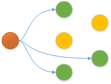

Figure 7 - Multicast scheme

Multicast is a one-to-many communication scheme. In an IP network and with IP multicast, a party which is interested in certain messages can join a multicast address. A multicast receiver (not to be confused with the ACDP Receiver), symbolized with a green dot in the above figure, typically joins a multicast group using the IGMP protocol. The network then takes care of forwarding the multicast packets, which are usually transported using UDP. There are basically two multicast modes: Any-Source-Multicast (ASM) and Source-Specific-Multicast (SSM). A good explanation of the different modes can be found on . In principle, in ASM a receiver does not know the sender and indicates that it accepts traffic from any source. The receiver only needs to know the multicast group address to which a sender sends traffic to. On the contrary, in SSM the receiver indicates from which real source address he would like to receive traffic.

In the case of ACDP, SSM doesn’t seem to be a viable option because of the uncertainty of both the Submitter’s and the Receiver’s IP address. With ASM, two basic patterns could be implemented. The first idea would be that an ACDP Submitter joins a pre-defined multicast address on which ACDP topology information is sent to. Such topology would essentially contain information about the Receiver, e.g. the IP address of a valid Receiver instance. The Submitter would then build up a unicast connection to the Receiver and send his ACDP Request using a unicast connection. This would be a good option from a security point of view, because ACDP Request information would not be sent directly to a multicast address which anybody can join and thus see the ACDP Request information. However, the Submitter will depend on the availability of the multicast sender in the network and may need to wait a while before the next message is sent to the multicast address. This would mean that a Submitter client would always need to implement some queuing mechanism to ensure that Demands don’t get lost.

The second option is to inverse this model. Any Receiver may join a pre-defined multicast address. All Submitters would send to this address. This allows for a large number of Receivers and has the main advantage that the Submitter really only needs to know the pre-defined multicast address. However, if no message layer encryption is enabled for the ACDP Request, an attacker in a multicast-enabled network may join this address and get a lot of information about the applications running in a network. On the other hand, the same is at least partially true in the other model. An attacker might as well send multicast information with his own IP endpoint information to the network. Such an impersonated Receiver behaviour could only be blocked if sending of multicast packets would somehow be controlled. As a matter of fact, both models have security concerns because sensitive information could be easily transmitted to an attacker. Thus, any multicast or broadcast approach should at least generate a warning if it is used without message layer encryption.

A common drawback of the multicast approaches is the fact that it needs configuration on the network devices. Although most modern devices support IP multicast and it is in principle not too difficult to enable these functions, many network administrators have not enabled automatic forwarding of multicast packets.

##### Anycast

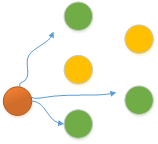

Figure 8 - Anycast scheme

In anycast, a sender sends the packets to its nearest receiver but it may also be received by all receivers. All receivers are identified through the same destination address. Such mechanisms are commonly used in environments where high-availability is a concern, for example the root servers in the public DNS infrastructure. In the case of ACDP, availability is not a big concern. From the author’s understanding, anycast requires the support of routing protocols such as BGP.

ACDP might implement anycast with reserved IP addresses in a private network. Any Receiver would then listen on these IP addresses and eventually receive ACDP Requests. However, due to the complexity of the protocols and its low popularity, the use of anycast for ACDP is questionable.

##### Geocast

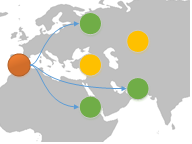

Figure 9 - Geocast scheme

Geocast is very similar to multicast. In fact it is a special form of multicast, where geographical information is taken into account. For ACDP, this is not an option because the protocol is only concerned about logical addressing and reachability.

#### Communication protocol

Based on the analysis in the previous chapter, a combination of three protocols has been chosen. Each implementation of a Submitter must implement all of the following operating modes:

-   Local configuration mode

    -   A Receiver’s IP address or DNS name is supplied to the (Submitter’s) configuration locally so that a Submitter can access this information whenever a Demand needs to be sent out to the network. A Demand will then be sent out to the resolved Receiver using the bidirectional API over a unicast TCP connection.

-   DNS discovery mode

    -   A Receiver’s IP address or DNS name is resolved through DNS SRV (Service) Resource Records as specified in RFC 2782 at initialization time of the Submitter and again resolved whenever the TTL of the resource record has expired AND a Demand needs to be sent out to the network. The resource record to be searching for is “\_acdpreceiver.\_tcp” for plain connections and “\_acdpreceivertls.\_tcp” for TLS protected connections. A Demand will then be sent out to the resolved Receiver using the bidirectional API over a unicast TCP connection.

-   Multicast sender mode

    -   A Receiver’s IP address or DNS name doesn’t need to be known to a Submitter. A Submitter selects a random UDP source port and sends a Demand to the multicast address 239.255.255.242 on port 42000 using the unidirectional API with a UDP datagram. This is the plain “Any-source multicast” mode, where multiple senders can be in the same group. A Submitter must always generate a warning message when messages are sent unencrypted using the multicast sender mode.

##### Configuration of the operating mode

A Submitter must be configurable with a few options regarding the operating mode to support different environments and address security concerns.

Each operating mode must be able to be disabled. If no operating mode is activated, the Submitter must not send a Request over the network. The Submitter should however still collect Demands and provide an interface to query for these Demands. As a side note, an implementer of a Submitter may, through this interface extend the functionality of the communication protocol. For example, he may use a completely different and more secure implementation and send the collected Demands over his own chosen protocol. However, such an interface should only be available through local programmatic access in the context of the running application, i.e. not through a network listener. If an implementer nevertheless chooses to expose this information through a network listener he must take care of all the associated security topics such as encryption, authentication, authorization and secure coding.

The multicast sender mode should be configurable to send out ACDP messages in parallel with any of the other modes. The local configuration and the DNS discovery mode should be able to be individually switched off which has the effect that only one source provides the Receiver’s IP address. When local configuration and the DNS discovery modes are both enabled, the flow must be according to the default selection algorithm of the operating mode. In the selection algorithm, the local configuration mode takes precedence over the DNS discovery mode to avoid double sending of ACDP messages.

##### Selection algorithm of the operating mode

If no allowed modifications of the operating mode have been configured, a Submitter automatically chooses an operating mode based on the following flowchart. An operating mode can change during the lifetime of a specific Submitter instance and is, in general, automatically chosen during initialization, when a new Demand needs to be sent or a retransmission of an existing Demand is scheduled.

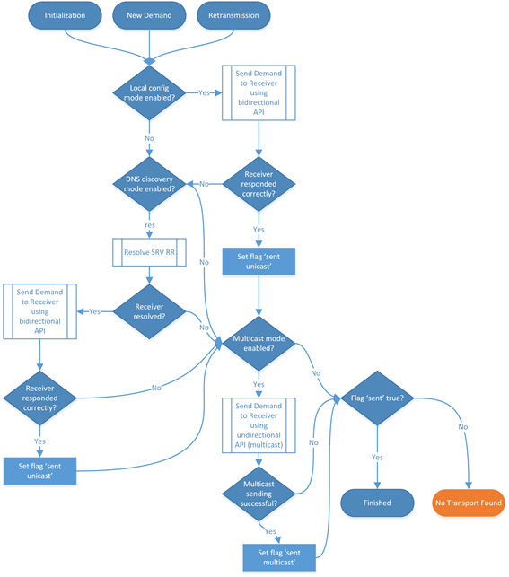

Figure 10 - Operating mode of the communication protocol

##### Retransmit behaviour

The Submitter must retransmit each collected unique Demand not later than every 24 hours. The Submitter must choose a random source port which is not occupied by the application to send out a message. In the case of the Multicast Sender Mode, UDP is used. In the case of one of the Unicast Modes, TCP is used.

Each Submitter should, after initialization send out previously collected Demands using an exponential backoff algorithm. Retransmit behaviour is configurable but cannot go beyond the maximum retransmit threshold of 24 hours.

##### Bidirectional API

When a Submitter selects either the Local configuration or the DNS discovery mode, a simple bidirectional API is used. A Submitter sends its messages over http or https to a Receiver which must accept the message without enforcing the use of any authentication mechanism. In case of https, the Submitter must perform proper TLS certificate verification according to RFC 5246 . The Submitter POSTs a message containing the “Content-Type: application/json” header and the body with an ACDP message, which can be either an ACDP Request or an ACDP Wrapper message.

    POST / HTTP/1.1
    User-Agent: node/http-request-lib/v0.1
    Accept: */*
    Content-Type: application/json
    Content-Length: 812
    Host: 192.168.177.134:42000
    Connection: close

    {"type":"ACDPREQUEST","submitter":{"description":"ACDP Submitter for Node.js version 0.1.0"},"demands":[{"consumer":{"id":"ae965553-f7a7-48ed-93ce-39cbe4b8d8c8","application":{"applicationid":"Your unique application ID goes here","instanceid":"93687b7c-e70a-4eef-b42e-ff8bb1842516"},"consumes":[{"endpoint":{"transportEndpoint":{"ports":[{"type":"TCP","number":80}]}}}],"fromProducers":[{"endpoint":{"networkEndpoint":{"fqdNames":["www.google.com."]}}}]}},{"consumer":{"id":"b7d60137-5c0a-4e34-b5a7-d06e4ebdac91","application":{"applicationid":"Your unique application ID goes here","instanceid":"93687b7c-e70a-4eef-b42e-ff8bb1842516"},"consumes":[{"endpoint":{"transportEndpoint":{"ports":[{"type":"TCP","number":443}]}}}],"fromProducers":[{"endpoint":{"networkEndpoint":{"fqdNames":["www.google.com."]}}}]}}]}

Listing 1 - HTTP Request for the bidirectional API

##### Unidirectional API

The unidirectional API is not really an API but more like a “fire and forget” mechanism. A Submitter simply sends the datagram to the predefined multicast address and port combination. A Submitter will never receive a response when using the unidirectional API.

Due to the security concerns pointed out further above, the Multicast Sender Mode should only be enabled if message encryption is active. If the Multicast Sender Mode is enabled and no message encryption is active, the Submitter must issue a warning at its initialization stage.

### Submitter behaviour

The Submitter’s two main responsibilities are the collection of Demands from application developers and sending of Demands. A Submitter should perform schema validation of the Request before sending it out over the SR interface. The validation is optional because it is always a Receiver’s responsibility to ensure that a Request conforms to the specification.

A Submitter function should be implemented as a library for all popular programming languages. Because of its limited and clearly defined responsibility, it should be fairly easy to adopt ACDP in different programming environments. A Submitter library must provide an interface to accept Demands in the ACDP JSON language. It should also provide a simplified notation to ensure library users can focus on their actual work rather than spending too much time on the creation of valid ACDP Demands. If such a simplified notation is used, the Submitter must ensure that it is correctly translated to the ACDP Request language.

A Submitter should not expect to get a response for an ACDP Request. It is assumed that unfulfilled communication demands must be handled by an application regardless of the state of the ACDP implementation or the configuration state of an ACDP Request. For example, if an application demands to consume an http API, it should phrase a Demand but then nevertheless already initiate communication to that API. If a device on the network path doesn’t allow communication, the application must perform adequate error handling, as it also should have done without ACDP. This also allows for a completely asynchronous nature of ACDP. However, to ensure that communication can be initiated only after an ACDP Demand has reached one of the states “RECEIVED”, “IMPLEMENTED” or “PROHIBITED”, an ACDP Submitter must provide an interface to the programmer which always includes such a state. When the unidirectional API is used, the Submitter must only respond with the state “RECEIVED”.

When the Submitter changes its IP address or its configuration, all Demands should be sent out again. Sending of Demands must always be implemented using an exponential backoff algorithm with a randomization factor. When all Demands should be resent at once, the Submitter should distribute the initial sending over a reasonable amount of time. This should ensure that in case of a large number of Demands, the Receiver is not flooded with messages. The same applies if many Demands are already proclaimed at initialization time.

### Receiver behaviour

A Receiver may be combined with the Controller and Enforcer functions in a single application or device. For example, a load-balancing device can itself act as a Receiver to receive Demands, perform a controlling function such as requiring manual acknowledgment by an administrator and then enforce a specific configuration to provide load-balancing for an application. The Receiver functions should be implemented as a library which can be implemented by a developer.

A Receiver may itself act as a Submitter. This is useful in situations where a NAT or a load-balancing device modifies an application’s network reachability. It should then send a modified Request over the SR interface to other Receivers which may be configured to automatically allow access to load-balanced applications. The original Demand should not be forwarded in such a constellation. A Receiver must not enforce any type of authentication on its unicast interface.

A Receiver must always perform validation of the ACDP message. A Receiver should first evaluate if the message is a valid JSON document. If it is not a valid JSON document, he must not perform the JSON schema validation. The Receiver must respond to the http request. The body of the response may contain an ACDP Response or an ACDP Wrapper message or an empty body. Listing 2 shows a valid response when the bidirectional API is used.

    HTTP/1.1 200 OK
    X-Powered-By: Express
    Content-Type: application/json; charset=utf-8
    Content-Length: 250
    ETag: W/"fa-Pb9GJmu+lE4y5nJOv8jpZQ"
    Date: Mon, 29 Feb 2016 16:14:06 GMT
    Connection: close

    {"type":"ACDPRESPONSE","receiver":{"description":"Shiny custom ACDP Receiver."},"request":{"state":"VALID"},"demands":[{"id":"ae965553-f7a7-48ed-93ce-39cbe4b8d8c8","state":"RECEIVED"},{"id":"b7d60137-5c0a-4e34-b5a7-d06e4ebdac91","state":"RECEIVED"}]}

Listing 2 - HTTP response example

The Receiver must be able to see a Submitter’s IP address in the received IP packet. Such low-level information always takes precedence over information found in the [Submitter][submitter] object of an ACDP Request message.

If an ACDP message is received within a short period of time both from the unidirectional as well as the bidirectional API, the Receiver should avoid forwarding the message. A Receiver should therefore implement a local queuing mechanism which is able to correlate identical Demands. If a Receiver receives an ACDP Request and the implementer decides to configure the network automatically, he must take care of such a correlation to avoid conflicts on the Enforcer or Controller.

The Receiver must provide an interface to the developer which gives him full control of all valid messages. The Receiver should also provide an interface to delegate control of invalid messages. A Receiver implementation should be able to perform translation of messages in such a way that an Enforcer or Controller can make use of the information.

### Controller and Enforcer behaviour

ACDP doesn’t impose any mandatory requirements on the RC, RE and CE interfaces. However, a component which configures an Enforcer using ACDP Requests should always perform an automatic clean-up of rules for which no Demand has been placed within the last 24 hours. The randomization factor of the backoff mechanism must be taken into account.

Proof of concept
------------------------------------------------------------------------------------------------------------------------------------------------------------------------------------------------------------

### Goals

A demonstration which involves the relevant components should show that ACDP can be implemented in such a way that rules can be automatically generated for a firewall. The following goals have been defined based on the above description of the reference architecture:

-   The semantics of the protocol provide enough information to configure a firewall which operates on the network and transport layers

-   Only a subset of the specification needs to be implemented for the proof of concept. An inductive approach shall show that from a specific case more generic cases can be implemented as well

-   Library code should be written in a way which makes it easy for an application developer to include ACDP in his projects

A formal proof of the completeness of the language is not part of this dissertation, but would be an approach for a later stage to identify gaps in the protocol.

### Test environment

Figure 11 depicts the network and application layout which has been chosen for the proof of concept. It consists of a number of virtual servers and networks, all running on a VMWare ESX host system.

It is basically built up as an isolated environment which is only reachable through a Jumphost (acdp-gw-jumphost). This Jumphost is exposed with SSH to the testing environment provided by the author’s company. The Jumphost can connect to all other servers using SSH and also serves as a simple continuous delivery server based on shell scripts. The development of the software happens on a system which has SSH access to the Jumphost. Whenever a new version is ready to be rolled out into the test environment, the IDE (WebStorm 11.0.3) pushes the files using SFTP to a specific directory on the Jumphost. Within this directory, for each application, a task is running which pushes the artefacts to the correct destination server. This happens through SCP and also includes pre- and post-deployment tasks such as starting and stopping running processes on each server. The deployment itself consists of downloading the sources from GitHub or NPM repositories.

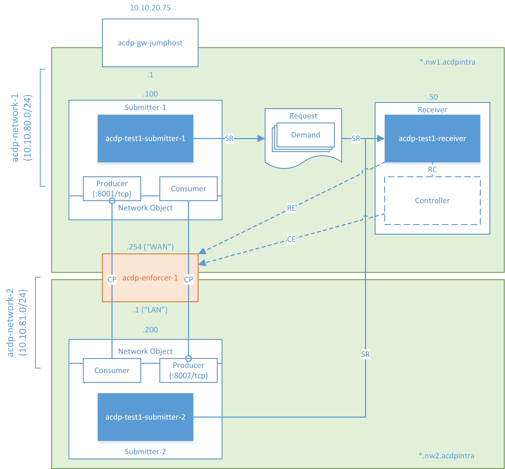

Figure 11 - Test setup for the proof of concept

The isolated environment is furthermore divided into two different networks. The acdp-network-1 in the upper part of the diagram (the “WAN” in pfSense terminology) contains a server called “Submitter-1” which is running an instance of a node.js application with the name “acdp-test1-submitter-1”, running on IP address 10.10.80.100. Also within this network, a server titled Receiver is configured to listen on the IP address 10.10.80.50. A node.js application called “acdp-test1-receiver” is configured to listen for both multicast and unicast messages on this specific server. The Receiver function is combined with a simplified Controller function which is a valid setup according to the specification. The second network in the lower part (the “LAN”) consists of a similar setup but without a Receiver component. Another application called “acdp-test1-submitter-2” is running on the Submitter-2 server. Between these two networks, a firewall in routing mode has been installed. It is called “acdp-enforcer-1” and its sole purpose is to block IP packets (default deny). During the research for this proof of concept, the author couldn’t identify any open source firewalls or iptables abstractions which provided readily available web APIs for consumption by the Receiver. Due to this, the author chose to write a new interface to an existing web UI for of a popular open source firewall project called “pfSense” .

Last but not least, the two mentioned applications shall both act as Consumers and Producers of a simple “Hello World” Web Server implemented in node.js.

### Test implementation

#### Programming Language

Although the author had more background knowledge in Java, he chose server-side JavaScript with node.js . JavaScript has become very popular in the last few years as can be seen on . One motivation for choosing node.js is its broad eco-system which would allow for quick results and will hopefully outweigh the additional effort for learning another programming language. Additionally, the dynamic and collaborative nature of the node.js community and its easy package management system NPM make it an ideal candidate for the adoption of this protocol draft.

#### Library code

As mentioned above, most of the functionality should be usable by a developer through library code. A simple interface should be sufficient to describe most communication needs. For this, two node.js packages have been written and published on GitHub. The Submitter and Receiver roles have been implemented in separate node packages because it is quite likely that different types of developers will use it.

Due to the size of the libraries, only the most relevant aspects of the code are described in these sections. An overview about the size of the various projects can be found in chapter 5.5. The code is published on GitHub and links to the git commits are provided for each component, based on the commit which has been used for the test run.

##### Submitter-nodejs

The submitter-nodejs package implements most of the features as described in the specification. Most notably, the DNS discovery mode has not yet been fully implemented.

All of the descriptions apply to the “submitter-nodejs” package with the exact commit found on GitHub . The most current version can be found on .

###### API

Four functions are provided to an application developer, the “init”, “consume”, “produce” and “rawDemands” functions. Besides these run-time functions, certain aspects of the library can be configured using an additional JSON-based configuration file which is described later in the chapter “Configuration of the library”. All callback functions are implemented to follow the pattern used by the Node.js core API .

acdp.init(options \[, callback\])

The “init” function can only be called once. It is synchronously executed but provides a sync as well as an asynchronous interface. The callback is optional. Because many options may be supplied in a future version, if one of these options fail, an error will be returned. Depending on the error, the program may continue to run. The response error always consists of an array with Error objects. Only if all options were successfully parsed, a string indicating success will be returned. The options object currently only supports the use of a *jwe* key which must use the algorithm “A256GCM”. The author decided to implement the handover of cryptographic keys as an initialization step to let the implementer freely choose how he wants to securely persist such a key (in contrary to configuration level options, which are persisted in the acdp.config.json file) The following examples show the use of the initialization function with an encryption key:

    var options = {
        "key": {
            kty: 'oct',
            kid: 'gBdaS-G8RLax2qgObTD94w',
            use: 'enc',
            alg: 'A256GCM',
            k: 'GawRLj79dCHEOyGKsDH1B5ww4Iv3WBw54AihTn3GtnQ'
        }
    };

    // async usage
    acdp.init(options, function (err, result) {
        if (err) console.log(err);
    });

    // sync usage
    var response = acdp.init(options);
    console.log(response);

Listing 3 - Initialization using an encryption key

The “consume” and “produce” functions provide an interface which is almost identical. They make use of a simplified shorthand notation which should make it very easy for an application developer to properly use ACDP. The acdpShorthand is an object or an array of objects which are built using the following idioms:

“app” – valid values are Integers or Strings. They refer to a type of application or a specific application running on another system. Example:

    {"app":"91553184-4cc2-41d3-a1b2-4bca97d6c34f"}

“tcp” – valid values are Integers from 1 to 65535. This value references a TCP port. Example:

    {"tcp":80}

“udp” – same as TCP, but with UDP ports

“sctp” – same as TCP, but with SCTP ports

“ip” – valid values are IP addresses according to the above chapter “IP address format”. Example:

    {"ip": "10.10.80.0/24"}

“special” – valid values are the primitives as described in “Special object”. Example:

    {"special":"KNOWN"}

“for” – valid values are objects of the above types, but their validity is restricted to the consume function and certain sibling keys. Example:

    acdp.produce({"tcp":80, "for":{"app":"1234567890123"}})

“from” – same as “for”, but only valid in the produce function. Example:

    acdp.consume({"tcp":80, "from":{"app":"1234567890123"}})

The following functions represent the main interfaces which are available for the propagation of Demands. All callbacks are optional. If they are supplied, they are currently only called after the first sending iteration. This behaviour should be changed in a later version so that a change of the state can be recognized by the user of the library. The result object passed to the callback contains the Demand as it was sent out over the wire, for example:

    {
      "type": "ACDPREQUEST",
      "submitter": {
        "description": "ACDP Submitter for Node.js version 0.1.0"
      },
      "demands": [
        {
          "producer": {
            "id": "256a64ff-3d4a-4044-b969-07a983a9584d",
            "application": {
              "applicationid": "Your unique application ID goes here",
              "instanceid": "55a0f0d0-8ba9-4a90-8641-9a51545ddb7c"
            },
            "produces": [
              {
                "endpoint": {
                  "transportEndpoint": {
                    "ports": [
                      {
                        "type": "TCP",
                        "number": 80
                      }
                    ]
                  }
                }
              }
            ],
            "forConsumers": [
              {
                "endpoint": {
                  "applicationEndpoint": {
                    "applications": [
                      {
                        "application": {
                          "applicationid": "1234567890123"
                        }
                      }
                    ]
                  }
                }
              }
            ]
          }
        }
      ]
    }

Listing 4 - ACDP Request as sent over the wire

acdp.consume(acdpShorthand \[, callback\])

The consume function creates ACDP requests for an application which needs to consume services from other applications over a network. A few valid examples:

    acdp.consume({“ip”: “10.10.81.200”, “tcp”: 80});
    acdp.consume({“url”: “http://www.protect7.com/”});
    acdp.consume([{“ip”: “74.125.136.0-74.125.136.255”}, {“url”: “https://www.google.com:443/”}]);
    acdp.consume({“tcp”: 443, “from”: {“app”: “App-with-some-name”}});
    acdp.consume({“app”: “1234567890123”, “special”: “KNOWN”}, function (err, result) {
        if (!err) console.log(result)
    });

Listing 5 – Valid acdp.consume() function calls

acdp.produce(acdpShorthand \[, callback\])

The produce function creates ACDP requests for an application which provides services to other applications. A few valid examples:

    acdp.produce({“tcp”: 443});
    acdp.produce({“tcp”: 443, “for”: {“app”: “1234567890123”}});
    acdp.produce({“tcp”: 443, “for”: {“ip”: “10.10.20.80”}});
    acdp.produce([{“tcp”: 443, “for”: {“app”: “1234567890123”}}, {“udp”: 123, “for”: {“app”: “1234567890123”}}]);
    acdp.produce({“tcp”: 80, “for”: {“app”: “1234567890123”}}, function (err, result) {
        console.log(JSON.stringify(result));
    });

Listing 6 – Valid acdp.produce() function calls

acdp.rawDemand(rawDemands \[, callback\])

The rawDemand interface is for advanced use cases where the shorthand notation might be insufficient. This function takes an array of objects which must comply with the ACDP Demands object. The following is a valid example, which takes the output from listing 4 as an input to this function:

    var rawDemands = [{
        “producer”: {
            “id”: “256a64ff-3d4a-4044-b969-07a983a9584d”,
            “application”: {
                “applicationid”: “Your unique application ID goes here”,
                “instanceid”: “55a0f0d0-8ba9-4a90-8641-9a51545ddb7c”
            },
            “produces”: [{
                “endpoint”: {
                    “transportEndpoint”: {
                        “ports”: [{
                            “type”: “TCP”,
                            “number”: 80
                        }]
                    }
                }
            }],
            “forConsumers”: [{
                “endpoint”: {
                    “applicationEndpoint”: {
                        “applications”: [{
                            “application”: {
                                “applicationid”: “1234567890123”
                            }
                        }]
                    }
                }
            }]
        }
    }];
    acdp.rawDemands(rawDemands, function (err, result) {
        console.log(JSON.stringify(result));
    });

Listing 7 – Valid acdp.rawDemands() function call

###### Configuration of the library

As mentioned before, several aspects of the behaviour of an ACDP Submitter are configurable. For this purpose, the user of the library can copy the acdp.config.json file from the “submitter-nodejs” root folder (under node\_modules) to the root of his own project. The following is an example which shows the configuration of the acdp-test1-submitter-2 application. It consists of all the keys which are user-configurable. Default values are set to a reasonable value and should be self-explanatory.

    {
      "application": {
        "name": "acdp-test1-submitter-2",
        "version": "Beta 1",
        "description": "A simple application which produces services for consumption by other applications",
        "applicationid": {
          "value": "acdp-test1-submitter-2",
          "random": false
        },
        "instanceid": {
          "random": true,
          "value": "instance id if not random"
        }
      },
      "protocols": {
        "unicast": {
          "localConfigMode": {
            "enabled": true,
            "config": {
              "dstProto": "http",
              "dstHost": "10.10.80.50",
              "dstPort": "42000",
              "dstPath": "/"
            }
          },
          "dnsDiscoveryMode": {
            "enabled": false,
            "autoSearchDomain": false,
            "manualSearchDomain": "your.domain"
          }
        },
        "multicast": {
          "multicastSenderMode": {
            "enabled": true
          }
        },
        "global": {
          "timing": {
            "minDelayMs": 3000,
            "randomizationFactor": 0.5
          }
        }
      },
      "encryption": {
      }
    }

Listing 8 - Configuration file for acdp-test1-submitter-2

###### Implementation of the SR interface

One important aspect is the correct implementation of the operating algorithm for the distribution of the ACDP Requests as described in chapter 3.2.4.2. The following listing shows the relevant part of the flow diagram as seen in figure 10, implemented using the popular async library .

    module.exports = {
        treatDemand: function (demandObj, callback) {
            async.waterfall([
                // perform the discovery and sending using a supplied endpoint
                function (callback) {
                    localNameDiscovery(demandObj, function (err, result) {
                        var state = {'sent': false};
                        if (err) {
                            logger.error(err.message);
                        } else {
                            state.sent = true;
                        }
                        callback(null, state);
                    })
                },
                // perform the discovery and sending using DNS discovery
                function (state, callback) {
                    if (state.sent) {
                        callback(null, state);
                    } else {
                        dnsDiscovery(demandObj, function (err, result) {
                            if (err) {
                                logger.error(err.message);
                            } else {
                                state.sent = true;
                            }
                            callback(null, state);
                        })
                    }
                },
                // perform the sending using multicast, regardless of the previous state
                function (state, callback) {
                    multicastDiscovery(demandObj, function (err, result) {
                        if (err) {
                            logger.error(err.message);
                        } else {
                            state.sent = true;
                        }
                        callback(null, state);
                    })
                }
            ], function (err, state) {
                if (err) {
                    callback(err)
                } else {
                    if (!state.sent) {
                        callback(new Error('No sending method was successful'))
                    } else {
                        callback(null, "sending ok")
                    }
                }
            });
        }
    };

Listing 9 - Implementation of the sending algorithm

##### Receiver-nodejs

All of the descriptions apply to the “receiver-nodejs” package with the exact commit found on Github . The most current version can be found on

###### API

The implementation of the Receiver is relatively simple in comparison with the Submitter. He only provides the “init” and the “respond” function for an implementer. The init function has exactly the same signature as the one already described for the Submitter implementation. The respond function actually expects a function as an input and is a bit special in that regard. However, with this construct, the developer of a Receiver has full access to respond to ACDP Requests if he may want to do so.

acdp.respond(externalResponseFunction)

The respond function serves as a way to gain complete control of the ACDP Response behaviour. The supplied parameter “externalResponseFunction” must be a function which takes three parameters (*options*, *acdprequest*, *callback*). The externalResponseFunction is internally called whenever an ACDP Request arrives. The ACDP Request is already validated and the state of the validation is communicated through the options object. Additionally, if a cryptographic key has been supplied through the init function, it performs decryption and sends the decrypted acdprequest object to the externalResponseFunction. Most importantly for the functionality of the whole protocol, it contains the real IP address which is necessary for further processing of the Request. The options object also contains information about the state of an ACDP Wrapper and looks like the following in a case where an encrypted message was received but no valid key was found to decrypt to ACDP Wrapper message. This will automatically result in an invalid state of the ACDP message as a whole. The state of the message is expressed with the key “valid” Boolean value:

    {
      "realip": "10.10.20.80",
      "receiverType": "multicast",
      "wrapperState": {
        "jwe": "No valid key available for crypto operations"
      },
      "valid": false
    }

Listing 10 - Options object containing the real source ip

The *acdprequest* parameter supplies the ACDP message to the implementer. If it is not wrapped, it will just be the plain ACDP message as it was received. In case if it is contained within a Wrapper message and decryption was successful, the plain ACDP Request message is decrypted and shown in plain text as is visible in listing 4. If it was wrapped and could not be unwrapped/decrypted, the raw wrapped/encrypted message is passed to the implementer.

The *callback* parameter must be supplied correctly by the implementer. It expects to receive a valid ACDP Response message as described in chapter 3.2.2. It must also provide a valid Response message even when the Submitter may not expect a response, e.g. if the Request was sent over the unidirectional API. If no externalResponseFunction is supplied, the library takes care of sending out a default answer (in case of the bidirectional API). However, if no such function is supplied, a Receiver really makes no sense.

###### Configuration of the network listeners

From the Receiver’s point of view, it doesn’t matter if he is being discovered through a local configuration or through DNS discovery by a Submitter. Thus the unicast listener for the bidirectional interface is identical for both configurations and can be seen in listing 11. It is implemented using the popular node.js express module . The call to *collector*.*receiveAcdpMessage* passes the http request body to a module called *requestCollector*.

    var collector = require('../requestCollector');
    var logger = require('../logger.js');
    var express = require('express');
    var bodyParser = require('body-parser');
    var config = require('../configloader');
    var ipaddr = require('ipaddr.js');
    var app = express();

    var ucPort = config.get('protocols:unicast:unicastReceiverMode:config:dstPort');

    var setupApp = function () {
        app.use(bodyParser.json());

        var listener = app.listen(ucPort, function () {
            logger.info('ACDP Unicast HTTP Receiver listening on ' + listener.address().port);
        });

        app.post('/', function (req, res) {
            logger.debug(req.body);
            var options = {};
            options.realip = ipaddr.process(req.ip).toString();
            options.receiverType = "unicast";
            options.httpHeaders = req.headers;
            collector.receiveAcdpMessage(options, req.body, function (err, result) {
                if (err) {
                    logger.error('Invalid message');
                    res.statusCode = 400;
                    return res.send(err);
                } else {
                    logger.info('received valid message');
                    res.statusCode = 200;
                    return res.send(result);
                }

            });
        });
    };

    module.exports = {
        start: setupApp
    };

Listing 11 - Implementation of the unicast listener

The multicast listener, as can be seen in listing 12, calls the same function in the *requestCollector*. The *requestCollector* thus receives both messages from the unicast as well as the multicast listener and processes the ACDP messages. It is responsible for unwrapping/decryption of the message, for validation against the schema and for calling the *externalResponseFunction*.

    var logger = require('../logger.js');
    var collector = require('../requestCollector');
    var config = require('../configloader');

    var mcPort = config.get('protocols:multicast:multicastReceiverMode:config:dstPort');
    var mcAddr = config.get('protocols:multicast:multicastReceiverMode:config:dstAddr');
    var mcTtl = config.get('protocols:multicast:multicastReceiverMode:config:ttl');
    var dgram = require('dgram');
    var client = dgram.createSocket('udp4');
    var ipaddr = require('ipaddr.js');

    var bindListener = function () {
        client.on('listening', function () {
            var address = client.address();
            logger.info('ACDP Multicast Receiver listening on ' + address.address + ":" + address.port);
            client.setBroadcast(true)
            client.setMulticastTTL(mcTtl);
            client.addMembership(mcAddr);
        });

        client.bind(mcPort);
        return client;
    };

    var startListen = function () {
        var mcClient = bindListener();
        mcClient.on('message', function (message, remote) {
            logger.debug('Received message from: ' + remote.address + ':' + remote.port);
            try {
                var reqObj = JSON.parse(message);
                var options = {};
                options.realip = ipaddr.process(remote.address).toString();
                options.receiverType = "multicast";
                collector.receiveAcdpMessage(options, reqObj);
            } catch (e) {
                logger.error(e);
            }
        });
    };

    module.exports = {
        start: startListen
    };

Listing 12 - Implementation of the multicast listener

###### Validation of the schema

If an ACDP Request message has been received, the Receiver must perform a validation against the schema. The schema is bundled with the library and is actually very simply invoked using the tv4 library .

    var fs = require('fs');
    var path = require('path');
    var tv4 = require('tv4');
    var logger = require('./logger.js');

    var demandSchema = JSON.parse(fs.readFileSync(path.join(__dirname, './schema/acdprequest.schema.v0.1.0.json'), 'utf8'));

    module.exports = {
        validate: function (acdpRequestObject, callback) {
            var valid = tv4.validate(acdpRequestObject, demandSchema);

            if (!valid) {
                callback(tv4.error, false);
            } else {
                callback(null, acdpRequestObject);
            }
        }
    };

Listing 13 - Validation against the ACDP Request Schema

##### Pfsense-fwcontrol

As a side project which is not part of this dissertation but came into life because of it, the author implemented a simple wrapper which uses html scraping techniques to automate the popular pfsense firewall. The node module can be found on . This module is used to act like a Controller in the actual implementation

#### Implemented code

##### Acdp-test1-receiver

    process.env.DEBUG = "acdp-receiver:*";

    var pfsenseUrl;

    console.log('working with ' + process.env.NODE_ENV + ' config');
    if (process.env.NODE_ENV == 'local') {
        pfsenseUrl = 'http://192.168.2.122/';
    }

    if (process.env.NODE_ENV == 'test1') {
        pfsenseUrl = 'http://10.10.80.254/'
    }

    var pfsense = require('pfsense-fwcontrol');
    var acdpReceiver = require('receiver-nodejs');
    var async = require('async');
    var firewall = require('./firewall');

    acdpReceiver.respond(function (options, acdprequest, callback) {
        if (options.valid) {
            console.log('We received something to respond to in the main program.');

            // just tell the client that we have received his stuff
            var resp = {
                "type": "ACDPRESPONSE",
                "receiver": {
                    "description": "acdp-test1-receiver"
                }
            };
            resp.demands = [];

            acdprequest.demands.forEach(function (demand) {
                var demandId;
                if (typeof demand.producer === 'undefined') {
                    demandId = demand.consumer.id;
                } else {
                    demandId = demand.producer.id;
                }
                resp.demands.push({'id': demandId, 'state': 'RECEIVED'});
            });
            callback(null, resp); // send the callback, don't wait for firewall configuration

            var rules = [];

            async.each(acdprequest.demands, function (demand, callback) {
                var tmpRules = firewall.createRuleTemplates(demand, options);
                tmpRules.forEach(function (rule) {
                    rules.push(rule);
                });
                callback();
            }, function (err) {
                if (err) {
                    console.error(err.message);
                } else {
                    firewall.activateRules(rules);
                }
            });

        } else {
            var resp = {
                "type": "ACDPRESPONSE",
                "receiver": {
                    "description": "acdp-test1-receiver"
                },
                "request": {
                    "state": "INVALID"
                }
            };
            callback(null, resp);
        }
    });

Listing 14 - Main program of the Receiver

The above listing shows the main code of the receiver. Through the *acdpReceiver*.*respond* call, a function is injected into the routines of the receiver-nodejs module. It can then act as the main responder function (the *externalResponseFunction*). The author decided to implement a simple version which just uses the state “RECEIVED” for the ACDP Response message. This results in fast response times in case the bidirectional API is used. Firewall configuration then happens asynchronously through a call to *firewall*.*createRuleTemplates*. With this configuration, the Submitter will never know if his Demands have been provisioned. However, as explained further above, this is a valid configuration and should be sufficient to demonstrate the effectiveness of the protocol.

The firewall rule creation happens through a very simple topology translator. Its functionality is very limited, and to implement a full topology and rule matching algorithm would have exceeded the scope of this dissertation. For example, the arrays are not completely evaluated. Thus, if a Demand would consume multiple Producers or Consumers, only the first one would be evaluated. Additionally, it doesn’t keep track of any previously configured rules and doesn’t try to match corresponding “inbound” and “outbound” rules to match Producers and Consumers. This is important for correct interpretation of the results of this test setup which will be shown next. Hence the firewall rule creation is not part of the scope of this dissertation, but it is nevertheless an important aspect to demonstrate the functionality. The code for the rule creation can be found in the appendix, in chapter 5.5. The source code of this example with the exact git commit as used for this test can be found on .

##### Acdp-test1-submitter-1

    process.env.TRACE = "acdp-submitter:*"; //acdp-test1-submitter-1

    var acdp = require('submitter-nodejs');
    var http = require('http');
    var httpOutbound = require('./httpconnect');

    var server = http.createServer(function (request, response) {
        response.writeHead(200, {"Content-Type": "text/plain"});
        response.end("Hello World\n");
    });

    var localPort = 8001;
    var remoteIp = "10.10.81.200";
    var remotePort = 8002;
    var remoteUrl = 'http://' + remoteIp + ':' + remotePort + '/';

    acdp.produce({"tcp": localPort, "for": {"ip": remoteIp}});
    server.listen(localPort);
    console.log("Server running. ");

    acdp.consume({"tcp": remotePort, "ip": remoteIp});
    httpOutbound.connect(remoteUrl);

Listing 15 - Main program of acdp-test1-submitter-1

With the statement **var *acdp ***= require(**'submitter-nodejs'**), the previously presented library is loaded into the scope of the main program. The http module is configured to start a web server, whose only responsibility is to produce a simple “Hello World” message. After the variable declarations are complete, the program starts with a first call to the submitter-nodejs library. ***acdp***.produce({**"tcp"**: ***localPort***, **"for"**: {**"ip"**: ***remoteIp***}}) which announces to the underlying network that a listener on port 8001 is ready for consumption by the remote IP address 10.10.81.200. After that (or rather in parallel), the server starts listening on that port. The second call ***acdp***.consume({**"tcp"**: ***remotePort***, **"ip"**: ***remoteIp***}) creates another Demand which indicates that this application wants to consume the TCP port 8002 from the same remote IP address. The source code of this example with the exact git commit as used in this test can be found on .

##### Acdp-test1-submitter-2

    process.env.TRACE = "acdp-submitter:*"; //acdp-test1-submitter-2

    var acdp = require('submitter-nodejs');
    var http = require('http');
    var httpOutbound = require('./httpconnect');

    var server = http.createServer(function (request, response) {
        response.writeHead(200, {"Content-Type": "text/plain"});
        response.end("Hello World\n");
    });

    var localPort = 8002;
    var remoteIp = "10.10.80.100";
    var remotePort = 8001;
    var remoteUrl = 'http://' + remoteIp + ':' + remotePort + '/';

    acdp.produce({"tcp": localPort, "for": {"ip": remoteIp}});
    server.listen(localPort);
    console.log("Server running. ");

    acdp.consume({"tcp": remotePort, "ip": remoteIp});
    httpOutbound.connect(remoteUrl);

Listing 16 - Main program of acdp-test1-submitter-2

The second application which resides in the LAN segment takes the code from acdp-test1-submitter-1 but changes the variables to reflect the situation as described in the test environment description. The source code of this example with the exact git commit as used in this test can be found on .

### Test execution and results

Even though the Controller function is not a main part of this dissertation, its effects on the acdp-enforcer are crucial to proof the desired functionality. The main subject that needs to be inspected is the firewall and that the communication between the two Submitter implementations works. The following steps demonstrate the effects of ACDP on the test environment from the initial situation up to the point when communication is established.

#### Step 1: Firewall configuration before ACDP

The pfSense firewall (acdp-enforcer-1) consists of two interfaces (WAN, LAN) which are configured through inbound rules. This basically means that a rule is applied when an IP packet enters from the network segment and wants to traverse the firewall or access the firewall itself. pfSense applies a “default deny” policy.

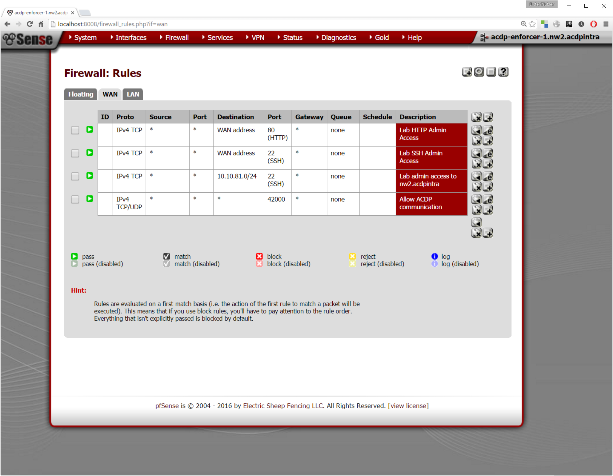

Figure 12 - Initial configuration of the WAN interface on acdp-enforcer-1

The above figure shows the rules which are configured before the test was started. Although most of the rules are self-explanatory, two of them are noteworthy in the context of ACDP. The first rule, which is described with “Lab HTTP Admin Access” is necessary for a) manual configuration to set up the basic ruleset through the Jumphost (tunnelled, hence the localhost URL in the address bar) and b) to allow access from the acdp-test1-receiver. Given the correct credentials, the Receiver can log in on this “WAN” interface to the firewall and perform rule creation and deletion. It might seem unreasonable to perform administrative functions through the WAN interface, but in terms of this setup, this is just unfortunate naming. The last rule which is described with “Allow ACDP communication” is essential in many network environments. If the protocol would be adopted in an organisation, such a rule should be configured on most firewalls. In this case, the rule on the WAN interface is not really necessary because no ACDP receiver is listening in the LAN segment, but to be consistent, the author chose to configure the ACDP rule on both interfaces.

Figure 13 displays the rules on the LAN interface. The first two rules are actually temporary rules which were of use during development. For this test, they were disabled, which is depicted with the greyed out font. The following six rules are used for continuous deployment on the servers in the “LAN” segment. In this case, there is only one server, the machine which has acdp-test1-submitter-2 running on it. The last rule, as mentioned before, serves as a foundation to allow ACDP communication over the network. In this case, this rule is crucial to be applied on the LAN interface, because acdp-test1-submitter-2 uses port 42000 to communicate with acdp-test1-receiver. The protocol in use for this test is the TCP variant, using the bidirectional API.

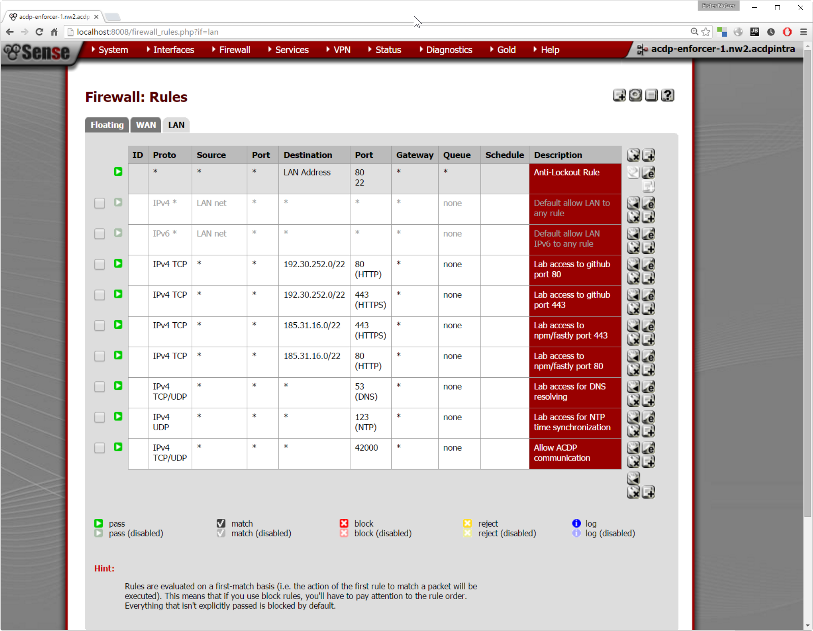

Figure 13 - Initial configuration of the LAN interface on acdp-enforcer-1

Before proceeding to the next step, all clocks were synchronized with NTP using the command “sudo ntpdate 0.ch.pool.ntp.org”, thus the timestamps show the order of execution. All commands were started automatically through the continuous deployment scripts and with the use of PM2 .

#### Step 2: Start acdp-test1-receiver

The following listing displays the first log entries of acdp-test1-receiver. As can be seen on the last two lines, it doesn’t do much more than just listening on UDP and TCP ports 42000. Because no ACDP Submitters are sending out Demands, it will just stay there until something is received on one of these ports.

    index-0 Wed, 02 Mar 2016 20:09:42 GMT axm:patch Wrapping HTTP routes
    index-0 Wed, 02 Mar 2016 20:09:42 GMT axm:proxy Wrapping method: _load
    index-0 working with test1 config
    index-0 Wed, 02 Mar 2016 20:09:42 GMT acdp-receiver:debug Override config file: /home/mas/scripts/acdp-test1-receiver/node_modules/receiver-nodejs/conf/acdp.overrides.json
    index-0 Wed, 02 Mar 2016 20:09:42 GMT acdp-receiver:debug User config file: /home/mas/scripts/acdp-test1-receiver/acdp.config.json
    index-0 Wed, 02 Mar 2016 20:09:42 GMT acdp-receiver:debug Default config file: /home/mas/scripts/acdp-test1-receiver/node_modules/receiver-nodejs/conf/acdp.defaults.json
    index-0 Wed, 02 Mar 2016 20:09:43 GMT acdp-receiver:info ACDP Multicast Receiver listening on 0.0.0.0:42000
    index-0 Wed, 02 Mar 2016 20:09:43 GMT acdp-receiver:info ACDP Unicast HTTP Receiver listening on 42000

Listing 17 - Status of acdp-test1-receiver after startup

#### Step 3: Start acdp-test1-submitter-2

The acdp-test1-submitter-2 is located in the network which is separated through acdp-enforcer-1. Because this represents the more complex configuration, this program has been started first. Listing 18 shows the most important log output. Right after the start of the program, the library tries to instantiate two Demands, one for the Producer and one for the Consumer as described before. The Requests are sent out using an internal request identifier, which in this case relates to a unique identifier for a Demand. The internal request ID 81342032-48ad-481b-8887-5ffd21e280a7 corresponds to the demand 765ad15e-7314-4dbd-83e7-846aa47ee6d3 (Violet). The internal request ID 79bd2dad-dfae-466a-bd56-f27107e50648 corresponds to the demand 5576063a-ce0a-4b9a-98a3-ed346f57cb30 (Light Green)

    index-0 Wed, 02 Mar 2016 20:19:36 GMT acdp-submitter:info Starting ACDP Submitter for Node.js version 0.1.0
    index-0 Wed, 02 Mar 2016 20:19:36 GMT acdp-submitter:debug Loading ACDP-Submitter from /home/mas/scripts/acdp-test1-submitter-2/node_modules/submitter-nodejs
    index-0 Wed, 02 Mar 2016 20:19:37 GMT acdp-submitter:debug Trying to instantiate request with id 79bd2dad-dfae-466a-bd56-f27107e50648
    index-0 Server running.
    index-0 Wed, 02 Mar 2016 20:19:37 GMT acdp-submitter:debug Trying to instantiate request with id 81342032-48ad-481b-8887-5ffd21e280a7
    index-0 Wed, 02 Mar 2016 20:19:37 GMT acdp-submitter:debug Crypto module has been initialized but did not receive any key
    index-0 (re-)starting connection attempt...
    index-0 Wed, 02 Mar 2016 20:19:37 GMT acdp-submitter:debug Trying to resend request 81342032-48ad-481b-8887-5ffd21e280a7
    index-0 Wed, 02 Mar 2016 20:19:37 GMT acdp-submitter:debug Trying to resend request 79bd2dad-dfae-466a-bd56-f27107e50648
    index-0 Wed, 02 Mar 2016 20:19:37 GMT acdp-submitter:debug Sent {"type":"ACDPREQUEST", ... {"consumer":{"id":"765ad15e-7314-4dbd-83e7-846aa47ee6d3", ... }}} to the wire...
    index-0 Wed, 02 Mar 2016 20:19:37 GMT acdp-submitter:debug Sending successful. Will propagate an error to continue backoff
    index-0 Wed, 02 Mar 2016 20:19:37 GMT acdp-submitter:debug Next sending in 3733ms
    index-0 Wed, 02 Mar 2016 20:19:37 GMT acdp-submitter:debug Sent {"type":"ACDPREQUEST", ... {"producer":{"id":"5576063a-ce0a-4b9a-98a3-ed346f57cb30", ...}}]} to the wire...
    index-0 Wed, 02 Mar 2016 20:19:37 GMT acdp-submitter:debug Sending successful. Will propagate an error to continue backoff
    index-0 Wed, 02 Mar 2016 20:19:37 GMT acdp-submitter:debug Next sending in 3790ms
    [...]
    index-0 (re-)starting connection attempt...
    index-0 (re-)starting connection attempt...
    index-0 (re-)starting connection attempt...
    index-0 Wed, 02 Mar 2016 20:20:05 GMT acdp-submitter:debug Trying to resend request 79bd2dad-dfae-466a-bd56-f27107e50648

Listing 18 - Status of acdp-test1-submitter-2 after initial start

The text in red indicates the http connection that acdp-test1-submitter-2 tries to build up with acdp-test1-submitter-1. As can be seen, it was not yet successful. The following two demands were sent over the wire:

    {
      "type": "ACDPREQUEST",
      "submitter": {
        "description": "ACDP Submitter for Node.js version 0.1.0"
      },
      "demands": [
        {
          "consumer": {
            "id": "765ad15e-7314-4dbd-83e7-846aa47ee6d3",
            "application": {
              "applicationid": "acdp-test1-submitter-2",
              "applicationname": "acdp-test1-submitter-2",
              "applicationversion": "Beta 1",
              "instanceid": "2c687e93-1bd0-4959-abf5-3f9f6b3bbe2a"
            },
            "consumes": [
              {
                "endpoint": {
                  "transportEndpoint": {
                    "ports": [
                      {
                        "type": "TCP",
                        "number": 8001
                      }
                    ]
                  }
                }
              }
            ],
            "fromProducers": [
              {
                "endpoint": {
                  "networkEndpoint": {
                    "ipAddresses": [
                      "10.10.80.100"
                    ]
                  }
                }
              }
            ]
          }
        }
      ]
    }

Listing 19 - ACDP Consumer Request which was sent to the receiver

    {
      "type": "ACDPREQUEST",
      "submitter": {
        "description": "ACDP Submitter for Node.js version 0.1.0"
      },
      "demands": [
        {
          "producer": {
            "id": "5576063a-ce0a-4b9a-98a3-ed346f57cb30",
            "application": {
              "applicationid": "acdp-test1-submitter-2",
              "applicationname": "acdp-test1-submitter-2",
              "applicationversion": "Beta 1",
              "instanceid": "2c687e93-1bd0-4959-abf5-3f9f6b3bbe2a"
            },
            "produces": [
              {
                "endpoint": {
                  "transportEndpoint": {
                    "ports": [
                      {
                        "type": "TCP",
                        "number": 8002
                      }
                    ]
                  }
                }
              }
            ],
            "forConsumers": [
              {
                "endpoint": {
                  "networkEndpoint": {
                    "ipAddresses": [
                      "10.10.80.100"
                    ]
                  }
                }
              }
            ]
          }
        }
      ]
    }

Listing 20 - ACDP Producer Request which was sent to the receiver

A few seconds later, acdp-test1-receiver receives the two ACDP Requests and creates rules for the two Demands. As can be seen in the last two lines of listing 21, the second time the Request is received, the rule cannot be created anymore because it already exists.

    index-0 Wed, 02 Mar 2016 20:19:41 GMT acdp-receiver:debug received a valid message
    index-0 Wed, 02 Mar 2016 20:19:41 GMT acdp-receiver:trace Message: {"type":"ACDPREQUEST", ... {"consumer":{"id":"765ad15e-7314-4dbd-83e7-846aa47ee6d3", ... }}}
    index-0 going to create a rule template for a consumer
    index-0 {"action":"create","params":{"type":"pass","ipprotocol":"inet","interface":"lan" ... "dstendport":8001,"descr":"765ad15e-7314-4dbd-83e7-846aa47ee6d3"}}
    index-0 Wed, 02 Mar 2016 20:19:41 GMT acdp-receiver:debug received a valid message
    index-0 Wed, 02 Mar 2016 20:19:41 GMT acdp-receiver:trace Message: {"type":"ACDPREQUEST", ... {"producer":{"id":"5576063a-ce0a-4b9a-98a3-ed346f57cb30", ... }}}
    index-0 going to create a rule template for a producer
    index-0 {"action":"create","params":{"type":"pass","ipprotocol":"inet","interface":"wan", ... "dstendport":8002,"descr":"5576063a-ce0a-4b9a-98a3-ed346f57cb30"}}
    index-0 [ { ruledesc: '765ad15e-7314-4dbd-83e7-846aa47ee6d3',
    index-0     status: 'created' } ]
    index-0 [ { ruledesc: '5576063a-ce0a-4b9a-98a3-ed346f57cb30',
    index-0     status: 'created' } ]
    [...]
    index-0 Wed, 02 Mar 2016 20:19:49 GMT acdp-receiver:info received valid message
    index-0 [ { ruledesc: '765ad15e-7314-4dbd-83e7-846aa47ee6d3',
    index-0     status: 'error',
    index-0     errormessage: 'Rule cannot be created. Rule already exists.' } ]

Listing 21 - Status of acdp-test1-receiver after Demands from acdp-test1-submitter-2

The pfSense-fwcontrol module takes the ACDP Request Producer or Consumer ID to ensure uniqueness of a rule. As mentioned before, it doesn’t perform any rule matching but simply provisions the rule on the firewall. The following two figures show that the rules have been successfully configured on the firewall. In the meantime, acdp-test1-submitter-2 could already connect to acdp-test1-submitter-1, but as it was in a backoff cycle, the check to confirm that the connection is successful was performed later on.

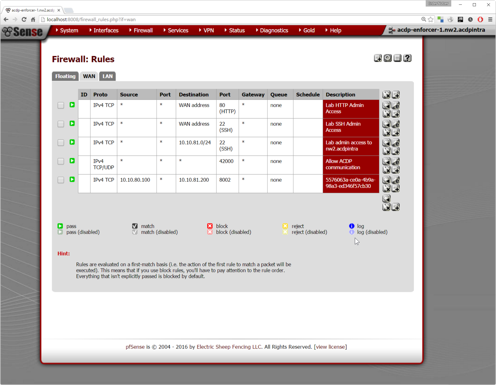

Figure 14 - Firewall after provisioning of Demand 5576063a-ce0a-4b9a-98a3-ed346f57cb30

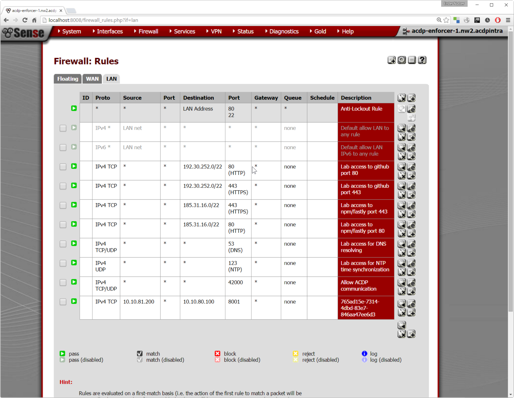

Figure 15 - Firewall after provisioning of Demand 765ad15e-7314-4dbd-83e7-846aa47ee6d3

#### Step 4: Start acdp-test1-submitter-1

The next step is to start acdp-test1-submitter-1. The log output is very similar and again formatted with colors. The Internal request ID 4542eef1-ff10-4df6-a211-7cfd1d176047 corresponds the demand 1555c89b-5b13-4c43-9112-808680e427ef (Light Orange) and the internal request ID 67b21c91-b310-4aeb-924c-7501e996b14e corresponds to the demand 196d692c-181a-4f37-8eea-e254409c375d (Light Blue).

    index-0 Wed, 02 Mar 2016 20:24:37 GMT acdp-submitter:info Starting ACDP Submitter for Node.js version 0.1.0
    index-0 Wed, 02 Mar 2016 20:24:37 GMT acdp-submitter:debug Loading ACDP-Submitter from /home/mas/scripts/acdp-test1-submitter-1/node_modules/submitter-nodejs
    index-0 Wed, 02 Mar 2016 20:24:38 GMT acdp-submitter:debug Trying to instantiate request with id 67b21c91-b310-4aeb-924c-7501e996b14e
    index-0 Server running.
    index-0 Wed, 02 Mar 2016 20:24:38 GMT acdp-submitter:debug Trying to instantiate request with id 4542eef1-ff10-4df6-a211-7cfd1d176047
    index-0 Wed, 02 Mar 2016 20:24:38 GMT acdp-submitter:debug Crypto module has been initialized but did not receive any key
    index-0 (re-)starting connection attempt...
    index-0 Wed, 02 Mar 2016 20:24:38 GMT acdp-submitter:debug Trying to resend request 4542eef1-ff10-4df6-a211-7cfd1d176047
    index-0 Wed, 02 Mar 2016 20:24:38 GMT acdp-submitter:debug Trying to resend request 67b21c91-b310-4aeb-924c-7501e996b14e
    index-0 Wed, 02 Mar 2016 20:24:38 GMT acdp-submitter:debug Sent {"type":"ACDPREQUEST", ... {"consumer":{"id":"1555c89b-5b13-4c43-9112-808680e427ef", ... }}} to the wire...
    index-0 connection attempt was successful. HTTP Body: Hello World
    index-0 Wed, 02 Mar 2016 20:24:38 GMT acdp-submitter:debug Sending successful. Will propagate an error to continue backoff
    index-0 Wed, 02 Mar 2016 20:24:38 GMT acdp-submitter:debug Next sending in 4328ms
    index-0 Wed, 02 Mar 2016 20:24:38 GMT acdp-submitter:debug Sent {"type":"ACDPREQUEST", ... {"producer":{"id":"196d692c-181a-4f37-8eea-e254409c375d",... }}} to the wire...
    index-0 Wed, 02 Mar 2016 20:24:38 GMT acdp-submitter:debug Sending successful. Will propagate an error to continue backoff
    index-0 Wed, 02 Mar 2016 20:24:38 GMT acdp-submitter:debug Next sending in 4050ms

Listing 22 - Status of acdp-test1-submitter-1 after initial start

Listing 22 already shows the first effect of the rule creation from before. Acdp-test1-submitter-1 can already connect to acdp-test1-submitter-2, because this Request has already been fulfilled (visible through the display of “Hello World”).

The acdp-test1-receiver again successfully receives the two Demands in separate ACDP Request messages:

    index-0 Wed, 02 Mar 2016 20:24:38 GMT acdp-receiver:debug received a valid message
    index-0 Wed, 02 Mar 2016 20:24:38 GMT acdp-receiver:trace Message: {"type":"ACDPREQUEST ...{"consumer":{"id":"1555c89b-5b13-4c43-9112-808680e427ef", ... }}}
    index-0 going to create a rule template for a consumer
    index-0 {"action":"create","params":{"type":"pass","ipprotocol":"inet","interface":"wan" ... "dstendport":8002,"descr":"1555c89b-5b13-4c43-9112-808680e427ef"}}
    index-0 [ { ruledesc: '1555c89b-5b13-4c43-9112-808680e427ef',
    index-0     status: 'created' } ]
    index-0 Wed, 02 Mar 2016 20:24:41 GMT acdp-receiver:debug received a valid message
    index-0 Wed, 02 Mar 2016 20:24:41 GMT acdp-receiver:trace Message: {"type":"ACDPREQUEST", ... {"producer":{"id":"196d692c-181a-4f37-8eea-e254409c375d" ... }}}
    index-0 going to create a rule template for a producer
    index-0 {"action":"create","params":{"type":"pass","ipprotocol":"inet","interface":"lan" ... "dstendport":8001,"descr":"196d692c-181a-4f37-8eea-e254409c375d"}}
    index-0 [ { ruledesc: '196d692c-181a-4f37-8eea-e254409c375d',
    index-0     status: 'created' } ]

Listing 23 - Status of acdp-test1-receiver after Demands from acdp-test1-submitter-1

The rules were successfully configured on the firewall:

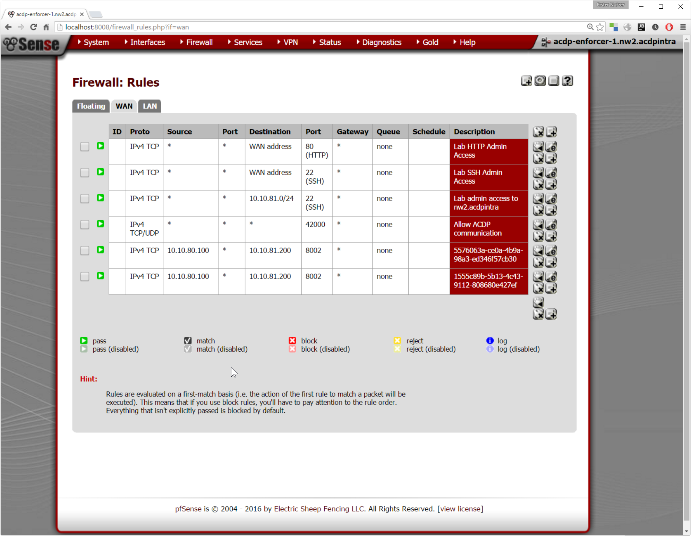

Figure 16 - Firewall after provisioning of Demand 1555c89b-5b13-4c43-9112-808680e427ef

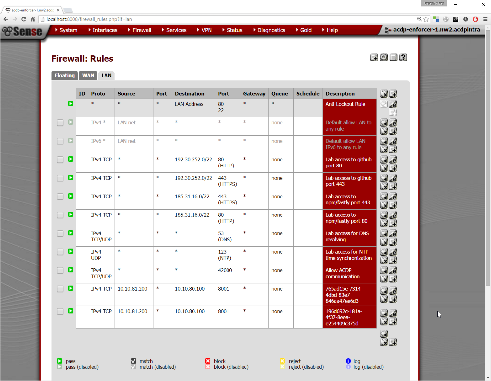

Figure 17 - Firewall after provisioning of Demand 196d692c-181a-4f37-8eea-e254409c375d

Due to the simplified implementation of the Controller, no duplicate rule check was performed. Because the rule was automatically provisioned on the firewall upon receiving the Demands, two rules which are semantically identical are now active on the firewall. They only differ through their description, which comes from the Demand ID.

#### Step 5: Check if connectivity works 

In the meantime, the backoff cycle of acdp-test1-submitter-2 (which was started first) returned to connect again shortly after 20:28:20. The response body “Hello World” is displayed, which indicates that the firewall is configured and a connection can be made according to the Demand which was sent out previously.

    index-0 Wed, 02 Mar 2016 20:20:05 GMT acdp-submitter:debug Trying to resend request 79bd2dad-dfae-466a-bd56-f27107e50648
    [...]
    index-0 Wed, 02 Mar 2016 20:20:07 GMT acdp-submitter:debug Next sending in 33377ms
    index-0 (re-)starting connection attempt...
    index-0 (re-)starting connection attempt...
    [...]
    index-0 Wed, 02 Mar 2016 20:20:40 GMT acdp-submitter:debug Next sending in 57167ms
    index-0 (re-)starting connection attempt...
    [...]
    index-0 Wed, 02 Mar 2016 20:23:44 GMT acdp-submitter:debug Next sending in 276394ms
    index-0 (re-)starting connection attempt...
    index-0 Wed, 02 Mar 2016 20:26:45 GMT acdp-submitter:debug Trying to resend request 79bd2dad-dfae-466a-bd56-f27107e50648
    [...]
    index-0 Wed, 02 Mar 2016 20:28:20 GMT acdp-submitter:debug Next sending in 439645ms
    index-0 (re-)starting connection attempt...
    index-0 connection attempt was successful. HTTP Body: Hello World

Analysis and discussion
====================================================================================================================================================================

Implementation
------------------------------------------------------------------------------------------------------------

As shown in 3.3 “Proof of concept”, the implementation works according to the specification. The shorthand notation provides a big benefit for an application developer who wants to use ACDP. It is really just a matter of a few keystrokes to create an ACDP Demand this way.

The submitter-nodejs library is already quite extensive and could possibly be released quite soon to interested developers. However, in terms of software engineering methods, a lack of testing in the library can be observed. It definitely needs some more attention and has a few known bugs, but it fulfils the postulated requirements.

In its current draft state, the submitter-nodejs implementation is limited to only allow the use of symmetric keys and one algorithm. This is a substantial risk in case when weaknesses are found in the algorithm. However, this is just a matter of changing a few lines of code. The specification itself allows the use of all types of JWE algorithms.

The configuration can currently be influenced through the local configuration file and the runtime options. This should be kept as a pattern for in-memory implementations of future ACDP libraries. For example, sensitive options such as cryptographic keys should probably not just be stored in a configuration file, but left to the developer to find a more appropriate storage mechanism. For testing purposes, the configuration directives should be exportable to the library user.

The simplified and combined “Receiver-Controller” implementation uses the Producer and Consumer ID to directly create firewall rules with this identifier. In reality, a Controller would need to first create tuples based on the Demands, wait for matching Producers or Consumers, and then create, through its own random identifier, a firewall rule based on matching tuples. This way, the duplicate rule creation which was experienced in the test, could be avoided.

An optional requirement for the Submitter is the local querying of processed Demands. This has not been implemented, but it seems very desirable from the author’s point of view. It would be very handy for the user of the library to get an overview of all Demands using such a mechanism.

Specification
-------------

The following five paragraphs are structured according to the five requirements postulated in chapter 1.2 “Idea description”.

The goal of speeding up the process of firewall change management through automation can certainly be achieved with ACDP. If a fully automated model, such as the one shown in the proof of concept, is in place, firewalls can be provisioned within seconds according to the needs of an application. However, due to the sensitive nature of such requests, a fully automated model should only be implemented when messages are sent with the use of an ACDP cryptographic message wrapper. But even if messages are sent encrypted, organisations may be rightly hesitant to fully automate provisioning of firewalls. However, in comparison with a traditional, manual mode of applying for firewall rules, the speed can already be greatly enhanced even if manual acknowledgement of demanded rules is in place. The first requirement (better speed) can thus be achieved with the use of ACDP.

The biggest advantage from the author’s point of view is the potential for better integrity and in turn security. Although it is not mandatory, rules should be deleted when no Demands have been received within a specified period of inactivity. An ACDP implementation which completely follows the specification including the optional recommendations takes automatic care of “active” or “inactive” rules. This can be seen as an integrity feature. If application developers write too broad ACDP Requests, the network cannot do much about it and it could actually result in a loss of integrity. However, the source of a Request is always clear and traceable and administrators or DevOps should be able to assess and adjust the state of the network. Thus, integrity is not just automatically given with ACDP, but it definitely provides the foundation to increase integrity.

Good tools are needed to benefit the most from an ACDP-enabled network. For example, DevOps should be able to login at some portal and see the state of the ACDP Requests under their responsibility. Such a portal could also be used to solve the key distribution problem for the cryptographic keys and would encompass the full lifecycle of an application. Such tools would need to be developed first, but once a healthy eco-system around the open ACDP protocol is alive, ACDP can also be seen as a tool to better define responsibilities. It is hard, if not impossible, to proof that requirements for professional environments are met. Security concerns in terms of message modifications and interception are quite well addressed with the use of JSON Web Encryption (JWE). Currently, the specification says nothing about message replay attacks. If an attacker gets hold of a message, he may be able to resend the message and keep a Demand open as long as he wants. This is possible because a Receiver is not bound to detect duplicate use of messages and a Submitter is not bound to use cryptographically secured messages only once or within an acceptable time frame. In fact, the Submitter implementation from the proof of concept just creates a cryptographic message once and then sends the same message over and over again. A final specification should probably also define validity periods for ACDP wrapper messages. The three different approaches to discovery of the ACDP Receiver should work in most organisations, especially if an implementation correctly follows the selection algorithm.

The ACDP Request language turned out to be more extensive than initially thought. Even though it is not very complicated to describe Demands using this language, it is just too big and nested for daily use by an application developer. From that point of view, the ACDP language doesn’t meet the required goal of making the adaptation to the protocol as simple as possible for developers. This was fortunately already clear before work on the proof of concept implementation started, which introduced a simplified “shorthand notation”. It is imperative that writers of ACDP libraries should also provide such a simplified way to access ACDP functions. Most probably, the official definition of a basic “shorthand notation” grammar should end up in a final specification to provide a common domain-specific language regardless of the general purpose language in use. Nevertheless, the herein described ACDP Request language can and should be simplified for a final version. For example, the “endpoint” nesting level could be omitted if the types of valid Endpoint objects are anyway directly enforced in the corresponding JSON schema.

The fifth requirement (extensibility) is only poorly addressed in the current draft. Although the CustomEndpoint object is defined, it is currently not allowed to be used anywhere within an ACDP Request. The reason for this odd situation is basically a lack of time spent on thinking where this object could be adequately used. The author finally decided that it is more sensible to not specify its use rather than just allow its use at many different places within an ACDP Request. If this powerful and totally open object is wrongly used and makes its way into a first version for public use, it would be very hard to get rid of it. Candidates for appropriate use are currently directly within the Produces and Consumes object, but good arguments need to be found why it should be there in the first place.

A few other aspects should be taken into account in a final specification. The use of IPv6 should be an integral part of ACDP because of the expected long duration of protocol adaptation. Currently, the specification only allows the description of UDP, TCP and SCTP Demands. Other protocols such as ICMP are not yet supported. This could be easily addressed with a generic “IP Protocol” (IPv4) or “Next Header” integer field to support all IP protocols. The regular expression which enforces the fully qualified domain name format in the ACDP Request scheme currently allows the use of the wildcard symbol “\*” within the top-level domain. This is against the specification and should be changed. The current terminology specifies the “bidirectional API” which is consumed over a “unicast” connection and the “unidirectional API” which is consumed over a “multicast” connection –this seems to be a bit counter-intuitive and should be reconsidered. In terms of extensibility, ACDP should also make provisions for the definition of different types of application layer protocols. For example, it would be desirable if HTTP URIs and methods could be exactly described to restrict use. Similarly, for other protocols like message queues, descriptions should be possible which allow a network-based restriction to specific queues for other endpoints. Such mechanisms may be seen as a form of coarse-grained authentication.

Final remarks
-------------

The underlying rationale for the introduction of this protocol is the way how infrastructure, especially network security equipment such as firewalls, is nowadays configured. In many projects in organisations of different sizes, “enabling security” on the infrastructure level is a tiresome and error-prone process. There is usually a huge gap between the time when communication behaviour is written in code and when that code actually hits a network and might fail to reach its destination due to improperly configured filters. ACDP may motivate application developers to formally describe their communication needs at development time and, on the other hand, infrastructure vendors to jointly provide for faster and more reliable networked computing.

This language can describe a variety of communication requirements which may be known at development or at run time of a program. In its current draft version it provides elements to “consume” or “produce” services. An application may demand, using a JSON document compliant to the ACDP Request Schema, consumption from a public service or, more generically, from another application. It does so by clearly defining different types of endpoints, such as an IP address and port combination and hence provides meaningful combinations depending on the context of use. In general, these JSON documents can be used independent of a specific distribution mechanism. Security concerns are addressed by requiring certain behaviour and the use of cryptography to support confidentiality and integrity protection.

As a follow-up to this dissertation, the author plans to invite more people to discuss the evolution of ACDP and envisions a formal description which could eventually lead to an RFC or a similar standards document.

Appendix
=====================================================================================================================================================

Table of figures
----------------

[Figure 1 - Application communication in a Cloud Foundry PaaS without security groups on spaces 2]

[Figure 2 - CF PaaS with a limited spaces configuration 2]

[Figure 3 - SDN Architecture from \[10\] 5]

[Figure 4 - ACDP Architectural Overview 11]

[Figure 5 - Broadcast scheme 26]

[Figure 6 - Unicast scheme 26]

[Figure 7 - Multicast scheme 27]

[Figure 8 - Anycast scheme 28]

[Figure 9 - Geocast scheme 28]

[Figure 10 - Operating mode of the communication protocol 30]

[Figure 11 - Test setup for the proof of concept 33]

[Figure 12 - Initial configuration of the WAN interface on acdp-enforcer-1 43]

[Figure 13 - Initial configuration of the LAN interface on acdp-enforcer-1 44]

[Figure 14 - Firewall after provisioning of Demand 5576063a-ce0a-4b9a-98a3-ed346f57cb30 46]

[Figure 15 - Firewall after provisioning of Demand 765ad15e-7314-4dbd-83e7-846aa47ee6d3 47]

[Figure 16 - Firewall after provisioning of Demand 1555c89b-5b13-4c43-9112-808680e427ef 48]

[Figure 17 - Firewall after provisioning of Demand 196d692c-181a-4f37-8eea-e254409c375d 49]

Table of listings
-----------------

[Listing 1 - HTTP Request for the bidirectional API 31]

[Listing 2 - HTTP response example 32]

[Listing 3 - Initialization using an encryption key 35]

[Listing 4 - ACDP Request as sent over the wire 36]

[Listing 5 – Valid acdp.consume() function calls 36]

[Listing 6 – Valid acdp.produce() function calls 36]

[Listing 7 – Valid acdp.rawDemands() function call 37]

[Listing 8 - Configuration file for acdp-test1-submitter-2 37]

[Listing 9 - Implementation of the sending algorithm 38]

[Listing 10 - Options object containing the real source ip 39]

[Listing 11 - Implementation of the unicast listener 39]

[Listing 12 - Implementation of the multicast listener 40]

[Listing 13 - Validation against the ACDP Request Schema 40]

[Listing 14 - Main program of the Receiver 41]

[Listing 15 - Main program of acdp-test1-submitter-1 42]

[Listing 16 - Main program of acdp-test1-submitter-2 42]

[Listing 17 - Status of acdp-test1-receiver after startup 44]

[Listing 18 - Status of acdp-test1-submitter-2 after initial start 45]

[Listing 19 - ACDP Consumer Request which was sent to the receiver 45]

[Listing 20 - ACDP Producer Request which was sent to the receiver 46]

[Listing 21 - Status of acdp-test1-receiver after Demands from acdp-test1-submitter-2 46]

[Listing 22 - Status of acdp-test1-submitter-1 after initial start 47]

[Listing 23 - Status of acdp-test1-receiver after Demands from acdp-test1-submitter-1 48]

[Listing 24 - Complete ACDP Request Schema 64]

[Listing 25 - Firewall rule creation in the Receiver 65]

ACDP Request Schema
----------------------------------------------------------------------------------------------------------------------------------------------------------------

    {
      "$schema": "http://json-schema.org/draft-04/schema#",
      "description": "ACDP Request schema which describes communication needs of a networked entity",
      "type": "object",
      "properties": {
        "type": {
          "enum": [
            "ACDPREQUEST"
          ]
        },
        "submitter": {
          "description": "Describes the environment of the ACDP Submitter",
          "type": "object",
          "properties": {
            "description": {
              "type": "string"
            },
            "endpoint": {
              "properties": {
                "networkEndpoint": {
                  "$ref": "#/definitions/networkEndpoint"
                }
              },
              "additionalProperties": false,
              "required": [
                "networkEndpoint"
              ]
            }
          },
          "additionalProperties": false
        },
        "demands": {
          "description": "An array of ACDP Demands, consisting of any number of producers or consumers",
          "type": "array",
          "uniqueItems": true,
          "minItems": 1,
          "items": {
            "oneOf": [
              {
                "type": "object",
                "properties": {
                  "consumer": {
                    "$ref": "#/definitions/consumer"
                  }
                },
                "additionalProperties": false
              },
              {
                "type": "object",
                "properties": {
                  "producer": {
                    "$ref": "#/definitions/producer"
                  }
                },
                "additionalProperties": false
              }
            ]
          }
        }
      },
      "additionalProperties": false,
      "required": [
        "type",
        "submitter",
        "demands"
      ],
      "definitions": {
        "producer": {
          "description": "Services which are produced for consumption by consumers",
          "type": "object",
          "properties": {
            "id": {
              "type": [
                "number",
                "string"
              ]
            },
            "description": {
              "type": "string"
            },
            "application": {
              "$ref": "#/definitions/application"
            },
            "produces": {
              "$ref": "#/definitions/produces"
            },
            "forConsumers": {
              "$ref": "#/definitions/forConsumers"
            }
          },
          "additionalProperties": false,
          "required": [
            "id",
            "application",
            "produces",
            "forConsumers"
          ]
        },
        "consumer": {
          "description": "Services which are consumed from producers",
          "type": "object",
          "properties": {
            "id": {
              "type": [
                "number",
                "string"
              ]
            },
            "description": {
              "type": "string"
            },
            "application": {
              "$ref": "#/definitions/application"
            },
            "consumes": {
              "$ref": "#/definitions/consumes"
            },
            "fromProducers": {
              "$ref": "#/definitions/fromProducers"
            }
          },
          "additionalProperties": false,
          "required": [
            "id",
            "application",
            "consumes",
            "fromProducers"
          ]
        },
        "consumes": {
          "type": "array",
          "uniqueItems": true,
          "minItems": 1,
          "items": {
            "oneOf": [
              {
                "type": "object",
                "properties": {
                  "endpoint": {
                    "properties": {
                      "transportEndpoint": {
                        "$ref": "#/definitions/transportEndpoint"
                      }
                    },
                    "additionalProperties": false,
                    "required": [
                      "transportEndpoint"
                    ]
                  }
                },
                "additionalProperties": false,
                "required": [
                  "endpoint"
                ]
              },
              {
                "type": "object",
                "properties": {
                  "endpoint": {
                    "properties": {
                      "applicationEndpoint": {
                        "$ref": "#/definitions/applicationEndpoint"
                      }
                    },
                    "additionalProperties": false,
                    "required": [
                      "applicationEndpoint"
                    ]
                  }
                },
                "additionalProperties": false,
                "required": [
                  "endpoint"
                ]
              }
            ]
          }
        },
        "produces": {
          "type": "array",
          "uniqueItems": true,
          "minItems": 1,
          "items": {
            "oneOf": [
              {
                "type": "object",
                "properties": {
                  "endpoint": {
                    "properties": {
                      "transportEndpoint": {
                        "$ref": "#/definitions/transportEndpoint"
                      }
                    },
                    "additionalProperties": false,
                    "required": [
                      "transportEndpoint"
                    ]
                  }
                },
                "additionalProperties": false,
                "required": [
                  "endpoint"
                ]
              }
            ]
          }
        },
        "forConsumers": {
          "type": "array",
          "uniqueItems": true,
          "minItems": 1,
          "items": {
            "oneOf": [
              {
                "type": "object",
                "properties": {
                  "endpoint": {
                    "properties": {
                      "networkEndpoint": {
                        "$ref": "#/definitions/networkEndpoint"
                      }
                    },
                    "additionalProperties": false,
                    "required": [
                      "networkEndpoint"
                    ]
                  }
                },
                "additionalProperties": false,
                "required": [
                  "endpoint"
                ]
              },
              {
                "type": "object",
                "properties": {
                  "endpoint": {
                    "properties": {
                      "applicationEndpoint": {
                        "$ref": "#/definitions/applicationEndpoint"
                      }
                    },
                    "additionalProperties": false,
                    "required": [
                      "applicationEndpoint"
                    ]
                  }
                },
                "additionalProperties": false,
                "required": [
                  "endpoint"
                ]
              }
            ]
          }
        },
        "fromProducers": {
          "type": "array",
          "uniqueItems": true,
          "minItems": 1,
          "items": {
            "oneOf": [
              {
                "type": "object",
                "properties": {
                  "endpoint": {
                    "properties": {
                      "networkEndpoint": {
                        "$ref": "#/definitions/networkEndpoint"
                      }
                    },
                    "additionalProperties": false,
                    "required": [
                      "networkEndpoint"
                    ]
                  }
                },
                "additionalProperties": false,
                "required": [
                  "endpoint"
                ]
              },
              {
                "type": "object",
                "properties": {
                  "endpoint": {
                    "properties": {
                      "applicationEndpoint": {
                        "$ref": "#/definitions/applicationEndpoint"
                      }
                    },
                    "additionalProperties": false,
                    "required": [
                      "applicationEndpoint"
                    ]
                  }
                },
                "additionalProperties": false,
                "required": [
                  "endpoint"
                ]
              }
            ]
          }
        },
        "application": {
          "type": "object",
          "properties": {
            "applicationid": {
              "type": [
                "number",
                "string"
              ]
            },
            "instanceid": {
              "type": [
                "number",
                "string"
              ]
            },
            "componentid": {
              "type": [
                "number",
                "string"
              ]
            },
            "applicationname": {
              "type": "string"
            },
            "applicationversion": {
              "type": "string"
            },
            "description": {
              "type": "string"
            }
          },
          "required": [
            "applicationid"
          ]
        },
        "endpoint": {
          "type": "object",
          "description": "UNUSED",
          "oneOf": [
            {
              "properties": {
                "networkEndpoint": {
                  "$ref": "#/definitions/networkEndpoint"
                }
              },
              "additionalProperties": false,
              "required": [
                "networkEndpoint"
              ]
            },
            {
              "properties": {
                "transportEndpoint": {
                  "$ref": "#/definitions/transportEndpoint"
                }
              },
              "additionalProperties": false,
              "required": [
                "transportEndpoint"
              ]
            },
            {
              "properties": {
                "applicationEndpoint": {
                  "$ref": "#/definitions/applicationEndpoint"
                }
              },
              "additionalProperties": false,
              "required": [
                "applicationEndpoint"
              ]
            }
          ]
        },
        "networkEndpoint": {
          "type": "object",
          "oneOf": [
            {
              "properties": {
                "ipAddresses": {
                  "$ref": "#/definitions/ipAddresses"
                }
              },
              "additionalProperties": false,
              "required": [
                "ipAddresses"
              ]
            },
            {
              "properties": {
                "fqdNames": {
                  "$ref": "#/definitions/fqdNames"
                }
              },
              "additionalProperties": false,
              "required": [
                "fqdNames"
              ]
            },
            {
              "properties": {
                "special": {
                  "$ref": "#/definitions/special"
                }
              },
              "additionalProperties": false,
              "required": [
                "special"
              ]
            }
          ]
        },
        "transportEndpoint": {
          "type": "object",
          "oneOf": [
            {
              "properties": {
                "ports": {
                  "type": "array",
                  "minItems": 1,
                  "uniqueItems": true,
                  "items": {
                    "$ref": "#/definitions/port"
                  }
                }
              },
              "additionalProperties": false,
              "required": [
                "ports"
              ]
            },
            {
              "properties": {
                "special": {
                  "$ref": "#/definitions/special"
                }
              },
              "additionalProperties": false,
              "required": [
                "special"
              ]
            }
          ]
        },
        "applicationEndpoint": {
          "type": "object",
          "oneOf": [
            {
              "properties": {
                "applications": {
                  "type": "array",
                  "minItems": 1,
                  "uniqueItems": true,
                  "items": {
                    "properties": {
                      "application": {
                        "$ref": "#/definitions/application"
                      }
                    },
                    "additionalProperties": false,
                    "required": [
                      "application"
                    ]
                  }
                }
              },
              "additionalProperties": false,
              "required": [
                "applications"
              ]
            },
            {
              "properties": {
                "special": {
                  "$ref": "#/definitions/special"
                }
              },
              "additionalProperties": false,
              "required": [
                "special"
              ]
            }
          ]
        },
        "customEndpoint": {
          "type": "object"
        },
        "port": {
          "type": "object",
          "properties": {
            "type": {
              "enum": [
                "TCP",
                "UDP",
                "SCTP"
              ]
            },
            "number": {
              "type": "integer"
            }
          },
          "additionalProperties": false,
          "required": [
            "type",
            "number"
          ]
        },
        "special": {
          "type": "object",
          "properties": {
            "type": {
              "enum": [
                "ANY",
                "KNOWN",
                "UNKNOWN"
              ]
            }
          },
          "additionalProperties": false,
          "required": [
            "type"
          ]
        },
        "fqdNames": {
          "type": "array",
          "minItems": 1,
          "uniqueItems": true,
          "items": {
            "$ref": "#/definitions/fqdn"
          }
        },
        "ipAddresses": {
          "type": "array",
          "minItems": 1,
          "uniqueItems": true,
          "items": {
            "$ref": "#/definitions/ipAddress"
          }
        },
        "fqdn": {
          "$ref": "#/definitions/pattern_fqdn"
        },
        "ipAddress": {
          "oneOf": [
            {
              "$ref": "#/definitions/pattern_single_ip"
            },
            {
              "$ref": "#/definitions/pattern_ip_subnet"
            },
            {
              "$ref": "#/definitions/pattern_ip_range"
            }
          ]
        },
        "pattern_single_ip": {
          "type": "string",
          "pattern": "^(([0-9]|[1-9][0-9]|1[0-9]{2}|2[0-4][0-9]|25[0-5]).){3}([0-9]|[1-9][0-9]|1[0-9]{2}|2[0-4][0-9]|25[0-5])$"
        },
        "pattern_ip_subnet": {
          "type": "string",
          "pattern": "^(([0-9]|[1-9][0-9]|1[0-9]{2}|2[0-4][0-9]|25[0-5]).){3}([0-9]|[1-9][0-9]|1[0-9]{2}|2[0-4][0-9]|25[0-5])(\/([0-9]|[1-2][0-9]|3[0-2]))$"
        },
        "pattern_ip_range": {
          "type": "string",
          "pattern": "^(([0-9]|[1-9][0-9]|1[0-9]{2}|2[0-4][0-9]|25[0-5]).){3}([0-9]|[1-9][0-9]|1[0-9]{2}|2[0-4][0-9]|25[0-5])-(([0-9]|[1-9][0-9]|1[0-9]{2}|2[0-4][0-9]|25[0-5]).){3}([0-9]|[1-9][0-9]|1[0-9]{2}|2[0-4][0-9]|25[0-5])$"
        },
        "pattern_fqdn": {
          "type": "string",
          "pattern": "^([-*a-zA-Z0-9]{1,63}\\.)+$"
        }
      }
    }

Listing 24 - Complete ACDP Request Schema

Firewall rule creation
------------------------------------------------------------------------------------------------------------------------------------------------------------------------------------------------------------------

The following listing shows the rule creation in acdp-test1-receiver through the pfSense-fwcontrol module:

    if (process.env.NODE_ENV == 'local') {
        pfsenseUrl = 'http://192.168.2.122/';
    }

    if (process.env.NODE_ENV == 'test1') {
        pfsenseUrl = 'http://10.10.80.254/'
    }

    var rangeCheck = require('range_check');
    var pfsense = require('pfsense-fwcontrol');
    var deasync = require('deasync');

    var activateRules = function (addRules) {
        var sync = true;
        var response = null;

        pfsense.start({
            baseUrl: pfsenseUrl,
            username: 'admin',
            password: 'pfsense'
            //proxy: 'http://localhost:8888'
        }, addRules, function (err, result) {
            if (err) {
                console.log(err);
                response = 'error';
                sync = false;
            } else {
                console.log(result);
                response = 'done';
                sync = false;
            }
        });

        while(sync) {require('deasync').sleep(3000);}
        return response;
    };

    var createRulesFromDemand = function (demand, options) {
        var rules = [];
        var demandType = 'producer';
        if (typeof demand.producer === 'undefined') {
            demandType = 'consumer';
        }

        var addRule = {
            action: 'create',
            params: {
                type: 'pass',
                ipprotocol: 'inet',
                interface: 'lan',
                srctype: 'single',
                src: '',
                srcbeginport: '',
                srcbeginport_cust: '',
                srcendport: '',
                srcendport_cust: '',
                dsttype: 'single'
            }
        };

        // topology
        if (rangeCheck.inRange(options.realip, '10.10.80.0/24') && demandType == 'consumer') {
            addRule.params.interface = 'wan'
        }
        if (rangeCheck.inRange(options.realip, '10.10.80.0/24') && demandType == 'producer') {
            addRule.params.interface = 'lan'
        }
        if (rangeCheck.inRange(options.realip, '10.10.81.0/24') && demandType == 'consumer') {
            addRule.params.interface = 'lan'
        }
        if (rangeCheck.inRange(options.realip, '10.10.81.0/24') && demandType == 'producer') {
            addRule.params.interface = 'wan'
        }

        if (demandType == 'consumer') {
            console.log('going to create a rule template for a consumer');

            addRule.params.src = options.realip;
            addRule.params.dst = demand.consumer.fromProducers[0].endpoint.networkEndpoint.ipAddresses[0];
            addRule.params.proto = demand.consumer.consumes[0].endpoint.transportEndpoint.ports[0].type;
            addRule.params.dstbeginport = demand.consumer.consumes[0].endpoint.transportEndpoint.ports[0].number;
            addRule.params.dstendport = demand.consumer.consumes[0].endpoint.transportEndpoint.ports[0].number;
            addRule.params.descr = demand.consumer.id;

        } else {
            console.log('going to create a rule template for a producer');

            addRule.params.src = demand.producer.forConsumers[0].endpoint.networkEndpoint.ipAddresses[0];
            addRule.params.dst = options.realip;
            addRule.params.proto = demand.producer.produces[0].endpoint.transportEndpoint.ports[0].type;
            addRule.params.dstbeginport = demand.producer.produces[0].endpoint.transportEndpoint.ports[0].number;
            addRule.params.dstendport = demand.producer.produces[0].endpoint.transportEndpoint.ports[0].number;
            addRule.params.descr = demand.producer.id;
        }

        rules.push(addRule);
        console.log(JSON.stringify(addRule));

        return rules;
    };

    module.exports = {
        activateRules: activateRules,
        createRuleTemplates: createRulesFromDemand
    };

Listing 25 - Firewall rule creation in the Receiver

Code Statistics
---------------

The following numbers show the “lines of code” for each module. Physical lines of code include empty lines, thus the second column represents the effective size of the modules more accurately. 3rd party libraries are not included in the line count.

### Submitter-nodes

| Path                                                 | Physical     | Source     |
|------------------------------------------------------|--------------|------------|
| submitter-nodejs\\index.js                           | 414          | 362        |
| submitter-nodejs\\lib\\acdpDraft01.js                | 35           | 30         |
| submitter-nodejs\\lib\\classifier.js                 | 82           | 76         |
| submitter-nodejs\\lib\\configloader.js               | 18           | 14         |
| submitter-nodejs\\lib\\constants.js                  | 37           | 32         |
| submitter-nodejs\\lib\\discovery\\dnssrv.js          | 20           | 18         |
| submitter-nodejs\\lib\\discovery\\localconfig.js     | 1            | 0          |
| submitter-nodejs\\lib\\discovery\\multicast.js       | 1            | 0          |
| submitter-nodejs\\lib\\logger.js                     | 25           | 14         |
| submitter-nodejs\\lib\\model\\ApplicationEndpoint.js | 12           | 9          |
| submitter-nodejs\\lib\\model\\Consumer.js            | 44           | 28         |
| submitter-nodejs\\lib\\model\\NetworkEndpoint.js     | 20           | 16         |
| submitter-nodejs\\lib\\model\\Producer.js            | 44           | 28         |
| submitter-nodejs\\lib\\model\\Request.js             | 164          | 97         |
| submitter-nodejs\\lib\\model\\Response.js            | 13           | 10         |
| submitter-nodejs\\lib\\model\\TransportEndpoint.js   | 15           | 11         |
| submitter-nodejs\\lib\\senderHandling.js             | 121          | 115        |
| submitter-nodejs\\lib\\senders\\multicast.js         | 64           | 56         |
| submitter-nodejs\\lib\\senders\\unicast.js           | 17           | 16         |
| Total                                                |              | 932        |

### Receiver-nodejs

| Path                                          | Physical     | Source     |
|-----------------------------------------------|--------------|------------|
| receiver-nodejs\\index.js                     | 52           | 36         |
| receiver-nodejs\\lib\\acdpDraft01.js          | 18           | 15         |
| receiver-nodejs\\lib\\configloader.js         | 18           | 14         |
| receiver-nodejs\\lib\\listeners\\multicast.js | 43           | 38         |
| receiver-nodejs\\lib\\listeners\\unicast.js   | 43           | 36         |
| receiver-nodejs\\lib\\logger.js               | 25           | 14         |
| receiver-nodejs\\lib\\requestCollector.js     | 83           | 69         |
| receiver-nodejs\\lib\\Response.js             | 15           | 11         |
| Total                                         |              | 233        |

### Pfsense-fwcontrol

| Path                                         | Physical     | Source     |
|----------------------------------------------|--------------|------------|
| pfsense-fwcontrol\\actions\\activateRules.js | 61           | 54         |
| pfsense-fwcontrol\\lib\\normalizers.js       | 63           | 57         |
| pfsense-fwcontrol\\lib\\scrapers.js          | 61           | 48         |
| pfsense-fwcontrol\\actions\\all.js           | 34           | 26         |
| pfsense-fwcontrol\\index.js                  | 116          | 105        |
| pfsense-fwcontrol\\actions\\deleteRule.js    | 79           | 70         |
| pfsense-fwcontrol\\actions\\login.js         | 70           | 60         |
| pfsense-fwcontrol\\actions\\createRule.js    | 92           | 76         |
| pfsense-fwcontrol\\actions\\searchRule.js    | 53           | 45         |
| pfsense-fwcontrol\\actions\\logout.js        | 26           | 20         |
| Total                                        |              | 561        |

[1] This document uses OSI model’s terminology from layer 1 to 4 . The term “application layer” as it is used in this dissertation comprises of OSI layers 5-7, reflecting the term “application layer” as it is defined in the TCP/IP model .

  [1 Introduction & Scope 1]: #_Toc445043949
  [1.1 Problem analysis 1]: #_Toc445043950
  [1.2 Idea description 3]: #_Toc445043951
  [1.3 Document Structure 4]: #_Toc445043952
  [2 Background research 5]: #_Toc445043953
  [2.1 Software defined networking 5]: #_Toc445043954
  [2.2 Automation and Orchestration 5]: #_Toc445043955
  [2.3 Discovery Protocols 6]: #_Toc445043956
  [2.4 Cloud Services 7]: #_Toc445043957
  [2.5 Description of communication patterns 7]: #_Toc445043958
  [2.6 DevOps 8]: #_Toc445043959
  [3 Project work 9]: #_Toc445043960
  [3.1 Reference architecture 9]: #_Toc445043961
  [3.2 Detail specification 12]: #_Toc445043962
  [3.3 Proof of concept 32]: #_Toc445043963
  [4 Analysis and discussion 50]: #_Toc445043964
  [4.1 Implementation 50]: #_Toc445043965
  [4.2 Specification 50]: #specification
  [4.3 Final remarks 52]: #final-remarks
  [5 Appendix 53]: #_Toc445043968
  [5.1 Bibliography 53]: #_Toc445043969
  [5.2 Table of figures 58]: #table-of-figures
  [5.3 Table of listings 58]: #table-of-listings
  [5.4 ACDP Request Schema 59]: #_Toc445043972
  [5.5 Firewall rule creation 64]: #_Toc445043973
  [5.6 Code Statistics 66]: #code-statistics
  [submitter]: #_Submitter_object
  [demands]: #_Demands_collection
  [networkEndpoint]: #_Layer_3_Endpoint
  [producer]: #producer-object
  [consumer]: #consumer-object
  [application]: #_Application
  [produces]: #produces-object
  [forConsumers]: #forconsumers-object
  [endpoint]: #endpoint-object
  [transportEndpoint]: #_Layer_4_Endpoint
  [applicationEndpoint]: #_Layer_7_Endpoint
  [consumes]: #_Consumes_collection
  [fromProducers]: #fromproducers-object
  [1]: #_TransportEndpoint_object
  [2]: #_Consumes_object
  [ipAddresses]: #ipaddresses-object
  [fdqNames]: #fqdnames-object
  [special]: #_Special_object
  [ports]: #ports-object
  [3]: #_Application_object
  [4]: #_NetworkEndpoint_object
  [IP Address]: #_IP_address_format
  [FQDN]: #_FQDN_format
  [receiver]: #receiver-object
  [5]: #demands-object-1
  [request]: #request-object-1
  [jwe]: #jwe-object
  [Figure 1 - Application communication in a Cloud Foundry PaaS without security groups on spaces 2]: #_Toc445043975
  [Figure 2 - CF PaaS with a limited spaces configuration 2]: #_Toc445043976
  [Figure 3 - SDN Architecture from \[10\] 5]: #_Toc445043977
  [Figure 4 - ACDP Architectural Overview 11]: #_Toc445043978
  [Figure 5 - Broadcast scheme 26]: #_Toc445043979
  [Figure 6 - Unicast scheme 26]: #_Toc445043980
  [Figure 7 - Multicast scheme 27]: #_Toc445043981
  [Figure 8 - Anycast scheme 28]: #_Toc445043982
  [Figure 9 - Geocast scheme 28]: #_Toc445043983
  [Figure 10 - Operating mode of the communication protocol 30]: #_Toc445043984
  [Figure 11 - Test setup for the proof of concept 33]: #_Toc445043985
  [Figure 12 - Initial configuration of the WAN interface on acdp-enforcer-1 43]: #_Toc445043986
  [Figure 13 - Initial configuration of the LAN interface on acdp-enforcer-1 44]: #_Toc445043987
  [Figure 14 - Firewall after provisioning of Demand 5576063a-ce0a-4b9a-98a3-ed346f57cb30 46]: #_Toc445043988
  [Figure 15 - Firewall after provisioning of Demand 765ad15e-7314-4dbd-83e7-846aa47ee6d3 47]: #_Toc445043989
  [Figure 16 - Firewall after provisioning of Demand 1555c89b-5b13-4c43-9112-808680e427ef 48]: #_Toc445043990
  [Figure 17 - Firewall after provisioning of Demand 196d692c-181a-4f37-8eea-e254409c375d 49]: #_Toc445043991
  [Listing 1 - HTTP Request for the bidirectional API 31]: #_Toc445043992
  [Listing 2 - HTTP response example 32]: #_Toc445043993
  [Listing 3 - Initialization using an encryption key 35]: #_Toc445043994
  [Listing 4 - ACDP Request as sent over the wire 36]: #_Toc445043995
  [Listing 5 – Valid acdp.consume() function calls 36]: #_Toc445043996
  [Listing 6 – Valid acdp.produce() function calls 36]: #_Toc445043997
  [Listing 7 – Valid acdp.rawDemands() function call 37]: #_Toc445043998
  [Listing 8 - Configuration file for acdp-test1-submitter-2 37]: #_Toc445043999
  [Listing 9 - Implementation of the sending algorithm 38]: #_Toc445044000
  [Listing 10 - Options object containing the real source ip 39]: #_Toc445044001
  [Listing 11 - Implementation of the unicast listener 39]: #_Toc445044002
  [Listing 12 - Implementation of the multicast listener 40]: #_Toc445044003
  [Listing 13 - Validation against the ACDP Request Schema 40]: #_Toc445044004
  [Listing 14 - Main program of the Receiver 41]: #_Toc445044005
  [Listing 15 - Main program of acdp-test1-submitter-1 42]: #_Toc445044006
  [Listing 16 - Main program of acdp-test1-submitter-2 42]: #_Toc445044007
  [Listing 17 - Status of acdp-test1-receiver after startup 44]: #_Toc445044008
  [Listing 18 - Status of acdp-test1-submitter-2 after initial start 45]: #_Toc445044009
  [Listing 19 - ACDP Consumer Request which was sent to the receiver 45]: #_Toc445044010
  [Listing 20 - ACDP Producer Request which was sent to the receiver 46]: #_Toc445044011
  [Listing 21 - Status of acdp-test1-receiver after Demands from acdp-test1-submitter-2 46]: #_Toc445044012
  [Listing 22 - Status of acdp-test1-submitter-1 after initial start 47]: #_Toc445044013
  [Listing 23 - Status of acdp-test1-receiver after Demands from acdp-test1-submitter-1 48]: #_Toc445044014
  [Listing 24 - Complete ACDP Request Schema 64]: #_Toc445044015
  [Listing 25 - Firewall rule creation in the Receiver 65]: #_Toc445044016
